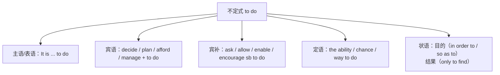

# 语法与语言运用（Using language）

**Unit 6 Nurturing nature**（外研版选择性必修第一册）｜语法专题：**动词不定式的用法综合**

## 语法讲解

### 不定式的句法功能

| 功能 | 例句 |
| --- | --- |
| 作主语（常用 It 形式主语） | **To protect** wildlife is our duty. = **It** is our duty **to protect** wildlife. |
| 作宾语 | The government decided **to build** a nature reserve. 政府决定建立自然保护区。 |
| 作宾语补足语 | The project enables villagers **to earn** a living from ecotourism. 项目使村民能靠生态旅游谋生。 |
| 作定语 | We still have a long way **to go**. 我们仍有很长的路要走。 |
| 作目的/结果状语 | Trees were planted **to hold back** the desert. 植树以阻挡沙漠。/ He grew up **to become** a ranger. 他长大后成为护林员。 |
| 作表语 | Our aim is **to restore** the wetland. 我们的目标是恢复湿地。 |

### 高频细节

1. **疑问词 + 不定式**：Experts discussed **how to save** the cranes.
2. **only to do 表意外结果**：He rushed to the nest, **only to find** it empty.
3. **不定式的被动式/完成式**：The reserve is said **to have been built** in 1985.
4. **省 to 的情形**：make/let/have/see/hear sb **do**（被动语态还原 to：be made **to do**）。
5. **too...to / enough to**：The issue is too urgent **to ignore**. / old enough **to volunteer**.

## 典型例题

**例1**（单选）：Measures have been taken ______ the river from further pollution.
A. protect  B. protecting  C. to protect  D. protected
**解析**：不定式作目的状语。答案 C。

**例2**（单选）：The rangers hurried to the hillside, ______ that the fire had already been put out.
A. finding  B. only to find  C. found  D. to finding
**解析**：表出乎意料的结果用 only to find。答案 B。

**例3**（语法填空）：Children should be encouraged ______ (take) part in tree-planting activities.
**解析**：encourage sb to do 的被动式。答案 to take。

## 易错点

1. 使役/感官动词主动省 to，**被动补 to**：He was made to leave。
2. hope/suggest 不接 sb to do（hope to do 可以；suggest doing）。
3. 形容词后不定式的逻辑宾语：The water is unfit to drink（不说 drink it）。
4. in order to 可置句首，so as to **不可**置句首。

## 背记要点

- 宾补高频动词：allow, enable, encourage, warn, remind, persuade + sb to do。
- 目的状语三件套：to do / in order to do / so as to do。
- 高考视角：语法填空常考被动后补 to 与 only to do 结果状语。

## 自测题

1. 语法填空：Villagers were made ______ (move) out of the core reserve area.
2. 单选：We have no choice but ______ green lifestyles. A. adopt  B. to adopt  C. adopting  D. adopted
3. 翻译：为了减少污染，市政府鼓励市民乘坐公共交通。（encourage; in order to）
4. 用 only to do 写一个含意外结果的句子。

**答案**：1. to move  2. B（have no choice but to do）  3. In order to reduce pollution, the city government encourages citizens to take public transport.  4. 合理即可（如 She opened the cage, only to see the bird fly away.）。

## 相关知识点

[[词汇与课文精读（Understanding ideas）]] ｜ [[读写与表达（Developing ideas）]]
