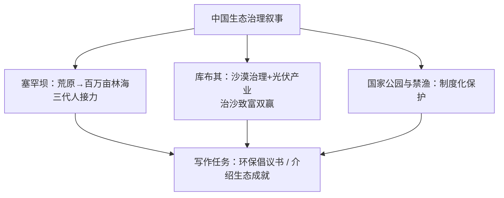

# 读写与表达（Developing ideas）

**Unit 6 Nurturing nature**（外研版选择性必修第一册）｜读写主题：中国生态治理成就与倡议书写作

## 拓展阅读要点

Developing ideas 部分聚焦**中国生态治理的实践**：塞罕坝三代人造林、库布其治沙模式、大熊猫国家公园、长江十年禁渔。阅读要点：把握"数据+故事"的说服结构——宏观数字展示成效，个体故事传递温度。

## 读写衔接词汇

| 表达 | 含义 | 写作应用 |
| --- | --- | --- |
| turn ... into ... | 把……变成…… | They turned the desert into an oasis. |
| generation after generation | 一代接一代 | Generation after generation carried on the work. |
| take concrete actions | 采取切实行动 | It's time to take concrete actions. |
| do one's bit for | 尽自己一份力 | Everyone can do their bit for the planet. |
| a win-win solution | 双赢方案 | Eco-tourism offers a win-win solution. |
| leave ... a better world | 留给……更好的世界 | Let's leave our children a better world. |

## 写作指导：环保倡议书（proposal/倡议信）

**结构模板**：
1. **点明背景与目的**：With Earth Day approaching, our Student Union proposes a "Green Campus" initiative.
2. **具体倡议（3 条）**：save paper and water / say no to single-use plastics / join tree-planting and recycling programmes.（每条=做法+简短理由）
3. **呼吁行动**：Small steps, when taken by all, lead to great changes. Let's act now and do our bit for a greener future!

**加分句式**：
- It is high time that we took concrete actions.（it is high time + 虚拟）
- Not only can these measures reduce waste, but they will also raise our awareness.（not only 倒装）
- Were everyone to join, the campus would change within a term.（虚拟倒装）

## 典型例题

**例1**（阅读理解）：What is the main purpose of mentioning the three generations of Saihanba foresters?
**解析**：意图题。以个体故事印证"坚持数十年方见成效"，增强感染力与说服力（to show perseverance behind the achievement）。

**例2**（书面表达）：请以学生会名义写一份英文倡议书，号召同学们参与"绿色校园"行动，内容包括：倡议背景、具体做法（至少三条）、呼吁参与。
**要点**：①背景与目的；②三条具体做法；③呼吁口号式结尾；注意倡议书语气（we propose / let's / join us）。

## 易错点

1. 倡议书用**第一人称复数**口吻，多用祈使句与情态动词。
2. it is high time that 后接**过去式/should do** 虚拟。
3. "垃圾分类"标准表达：garbage sorting / waste sorting。
4. 倡议条目用**平行结构**（动词开头），整齐有力。

## 背记要点

- 高考视角：倡议书是北京卷应用文重点体裁，背景—做法—呼吁三段式必须熟练。
- 必背表达：take concrete actions / do one's bit for / a win-win solution / turn ... into ...。
- 主旨句型：We do not inherit the earth from our ancestors; we borrow it from our children. 地球不是祖先的馈赠，而是向子孙的借用。

## 自测题

1. 用 turn ... into ... 写一句概括塞罕坝成就的句子。
2. 翻译：是我们采取切实行动保护环境的时候了。（It is high time）
3. 列出倡议书的三段式结构要点。
4. 写出 do one's bit for、a win-win solution 的含义并各造一句。

**答案**：1. Three generations turned the barren land into a vast forest.（合理即可）  2. It is high time that we took concrete actions to protect the environment.  3. 背景目的—具体倡议—呼吁行动。  4. 尽自己一份力；双赢方案（造句合理即可）。

## 相关知识点

[[词汇与课文精读（Understanding ideas）]] ｜ [[语法与语言运用（Using language）]]
