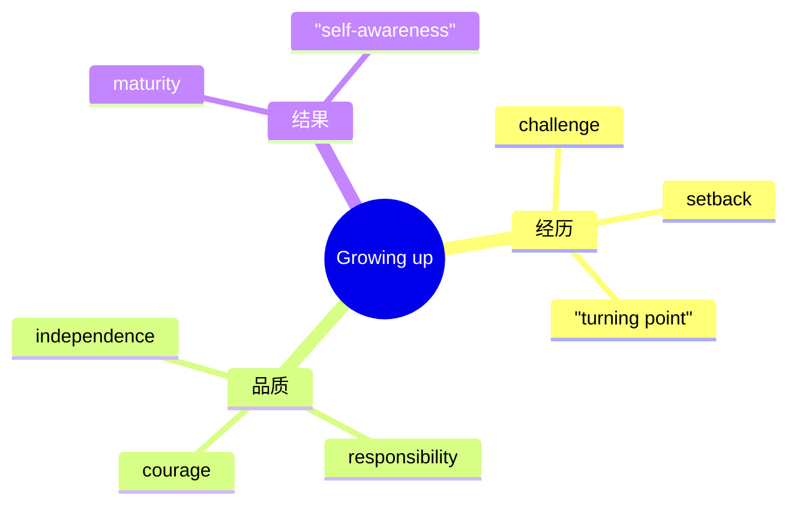

# Unit 1 Growing up · 词汇与课文精读（Understanding ideas）

## 主题导入

本单元主题为"成长"（Growing up），课文以少年成长故事切入，探讨成长过程中的选择、挫折与责任担当。学习目标：掌握成长主题核心词汇 15 个左右；理解"成长意味着学会承担与取舍"的主旨；剖析含倒装与定语从句的长难句。

## 核心词汇

| 单词 | 词性 | 释义 | 搭配例句 |
| --- | --- | --- | --- |
| adolescence | n. | 青春期 | During adolescence, we form our own values. 青春期我们形成自己的价值观。 |
| mature | adj./v. | 成熟的；成熟 | She has grown into a mature young woman. 她已成长为成熟的年轻女性。 |
| independence | n. | 独立 | Leaving home taught him independence. 离家教会了他独立。 |
| responsibility | n. | 责任 | take responsibility for one's actions 为自己的行为负责。 |
| setback | n. | 挫折 | He overcame one setback after another. 他克服了一个又一个挫折。 |
| confront | v. | 面对；直面 | We must confront difficulties bravely. 我们必须勇敢面对困难。 |
| adjust | v. | 调整；适应 | It took time to adjust to the new school. 适应新学校花了些时间。 |
| accompany | v. | 陪伴 | Growth is often accompanied by pain. 成长常伴随痛苦。 |
| tolerate | v. | 容忍 | Learning to tolerate differences is part of growing up. 学会包容差异是成长的一部分。 |
| regret | n./v. | 后悔 | He regretted not listening to his parents. 他后悔没听父母的话。 |
| ambition | n. | 抱负 | a young man with great ambition 有远大抱负的年轻人。 |
| identity | n. | 身份认同 | Teenagers are searching for their identity. 青少年在寻找自我认同。 |
| transform | v. | 转变 | The experience transformed him completely. 那次经历彻底改变了他。 |
| cherish | v. | 珍惜 | Cherish the time you spend with family. 珍惜与家人相处的时光。 |
| dilemma | n. | 两难困境 | He faced a dilemma between study and hobby. 他面临学业与爱好的两难。 |

## 短语与句型

1. **grow out of**：长大后不再有（The boy grew out of his fear of the dark.）
2. **look back on**：回顾（Looking back on my childhood, I feel grateful.）
3. **make the most of**：充分利用（Make the most of your school years.）
4. **It is through ... that ...**：强调句（It is through setbacks that we truly grow.）
5. **What matters is not ... but ...**：（What matters is not the result but the growth.）

## 课文理解要点

- 课文结构：以主人公的一次重大选择开篇 → 描写内心挣扎与外部压力 → 通过关键事件（转折点）实现心理成长 → 结尾点题"成长即学会承担"。
- 长难句：**Only when he stood at the crossroads did he realise that growing up meant making choices he would have to live with.** 剖析：Only when 状语从句置于句首引起主句部分倒装（did he realise）；that 引导宾语从句；he would have to live with 为省略关系词的定语从句。译：只有站在人生十字路口时，他才意识到成长意味着做出自己必须承受后果的选择。
- 主旨：成长不是年龄的增长，而是心智的成熟——学会选择、承担与珍惜。

## 背记要点

- 高考视角：成长与选择是北京卷读后续写和应用文的高频话题。
- 必背搭配：take responsibility for / adjust to / look back on / grow out of。
- 主旨句型：Growing up is not about getting older, but about becoming wiser.
- 写作加分句：It is through setbacks that we truly grow.
- 区分：mature（心理成熟）与 grown-up（成年的）语义侧重不同。

## 自测题

1. 语法填空：Only when we leave home ______ (do) we understand the value of independence.
2. 单选：The failure turned out to be a ______ in her career. A. setback  B. turning point  C. identity  D. regret
3. 翻译：成长常常伴随着痛苦，但正是挫折让我们变得成熟。（accompany; setback）
4. 写出 confront、cherish 的中文含义并各造一句。

**答案**：1. do  2. B  3. Growth is often accompanied by pain, but it is setbacks that make us mature.  4. 面对；珍惜（造句合理即可）

## 相关知识点

[[Unit 1 · 语法与语言运用]] ｜ [[Unit 1 · 读写与表达]]
