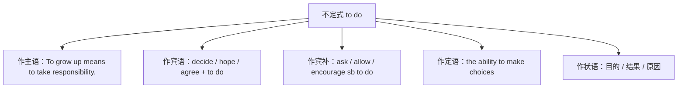

# Unit 1 Growing up · 语法与语言运用（Using language）

## 语法聚焦

本单元语法专题：**动词不定式（infinitives）复习与拓展**。不定式（to do）是非谓语动词的一种，可在句中作主语、宾语、宾语补足语、定语、状语和表语，是北京高考语法填空与写作的核心考点。

## 用法梳理

| 功能 | 结构 | 例句 |
| --- | --- | --- |
| 主语 | To do ... / It is + adj. + to do | It takes courage to admit mistakes. 承认错误需要勇气。 |
| 宾语 | decide / choose / manage + to do | He decided to leave his comfort zone. 他决定走出舒适区。 |
| 宾补 | encourage / expect / want sb to do | My parents encouraged me to be independent. 父母鼓励我独立。 |
| 定语 | n. + to do | She made a promise to work harder. 她承诺更加努力。 |
| 目的状语 | to do / in order to / so as to | He got up early (in order) to catch the train. 他早起为了赶火车。 |
| 结果状语 | only to do（意外结果） | He rushed home, only to find the door locked. 他赶回家却发现门锁着。 |
| 不定式的时态与语态 | to be done / to have done | He was proud to have been chosen. 他为曾被选中而自豪。 |

## 典型例句

1. **疑问词 + to do**：I don't know how to balance study and hobbies.（作宾语）
2. **too ... to do**：He was too nervous to speak.（太……而不能）
3. **enough to do**：She is old enough to make her own decisions.
4. **省略 to 的情况**：感官动词与使役动词后（see/hear/make/let sb do），被动语态中 to 还原：He was made **to apologise**.

## 易错点

1. stop to do（停下来去做另一件事）与 stop doing（停止正在做的事）意义不同；类似的还有 remember/forget/regret to do 与 doing。
2. 使役动词 make/let/have 后接不带 to 的不定式，但变被动后必须补回 to。
3. only to do 表示**出乎意料的结果**，不能表目的。
4. 不定式表将来意味：hope/plan/intend to do 后的动作尚未发生。

## 背记要点

- 五大功能口诀：主宾补定状，表语也能当。
- 高频动词：decide, manage, afford, refuse, promise, agree + to do。
- 宾补高频：encourage / allow / advise / expect sb to do。
- 高考视角：语法填空常考"目的状语 to do"与"被动 to be done"。
- 写作加分句：To grow is to learn from every setback.

## 自测题

1. 语法填空：He hurried to the station, only ______ (find) the train had left.
2. 单选：The teacher made us ______ the passage aloud. A. to read  B. read  C. reading  D. reads
3. 翻译：父母应该鼓励孩子独立做决定。（encourage sb to do）
4. 改错：She was seen enter the classroom quietly.

**答案**：1. to find  2. B  3. Parents should encourage their children to make decisions independently.  4. enter 前加 to（被动语态中还原 to）。

## 相关知识点

[[Unit 1 · 词汇与课文精读]] ｜ [[Unit 1 · 读写与表达]]
