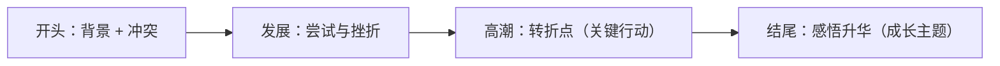

# Unit 1 Growing up · 读写与表达（Developing ideas）

## 读写任务

本课围绕"成长中的难忘经历"展开读写训练。阅读文本讲述一位少年在志愿活动中克服胆怯、收获自信的故事；写作任务为记叙文/读后续写：**描述一次让你成长的经历**，要求叙事完整、情感真实、有细节描写与主题升华。

## 写作模板与句式

**开头（设置背景与冲突）**
- Looking back on my high school years, one experience stands out clearly in my memory.
- I had never imagined that a simple task could teach me so much about growing up.

**发展（描写挣扎与尝试）**
- My heart pounded and my hands trembled, but I told myself not to give up.
- Despite repeated failures, I gritted my teeth and tried again.

**高潮（转折与关键行动）**
- At that very moment, an idea flashed through my mind.
- Taking a deep breath, I stepped forward and faced the challenge.

**结尾（感悟升华）**
- It was through this experience that I learned what responsibility truly means.
- Growing up, I realise, is not measured by age but by the courage to confront difficulties.

**情感与细节描写句式**
- A sense of achievement washed over me. / Tears of joy welled up in my eyes.
- The warm applause reminded me that every effort would pay off.

## 范文提纲

**题目**：An Experience That Helped Me Grow

1. **Para 1 背景冲突**：第一次担任班级活动负责人，毫无经验，同学质疑，内心忐忑（nervous, doubt myself）。
2. **Para 2 挫折尝试**：排练屡屡出错，几乎想放弃；老师一句"Mistakes are part of growing up"点醒了我；调整方案、逐一沟通（communicate patiently, adjust the plan）。
3. **Para 3 高潮结果**：活动圆满成功，掌声响起，收获信任（a sense of achievement）。
4. **Para 4 感悟升华**：成长即直面困难、承担责任（It is through setbacks that we truly grow）。

## 背记要点

- 记叙文四步结构：背景冲突 → 挫折尝试 → 转折高潮 → 感悟升华。
- 情感描写三件套：心理（heart pounding）、动作（gritted my teeth）、环境（warm applause）。
- 升华句必备：Growing up is not measured by age but by courage.
- 高考视角：北京卷读后续写重视情节合理与情感线连贯。
- 避免流水账：每段聚焦一个场景，用细节代替概括。

## 自测题

1. 用 It is through ... that ... 改写：Setbacks make us grow.
2. 写出两个描写"紧张"的英文句子。
3. 为"第一次登台演讲"写一个包含动作细节的高潮段句子。
4. 列出记叙文结尾升华的两个常用句式。

**答案**：1. It is through setbacks that we grow.  2. 如 My heart pounded. / My hands trembled.（合理即可）  3. 如 Taking a deep breath, I walked onto the stage and began my speech.  4. It was through ... that ... / Growing up is not measured by ... but by ...

## 相关知识点

[[Unit 1 · 词汇与课文精读]] ｜ [[Unit 1 · 语法与语言运用]]
