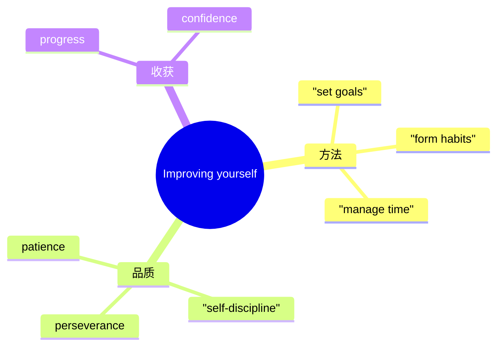

# Unit 2 Improving yourself · 词汇与课文精读（Understanding ideas）

## 主题导入

本单元主题为"自我提升"（Improving yourself），课文讲述人物通过坚持不懈的努力克服自身弱点、实现自我完善的故事，探讨习惯养成、时间管理与终身学习。学习目标：掌握自我提升主题词汇 15 个左右；理解"进步源于日复一日的坚持"这一主旨；剖析含 -ing 形式与并列结构的长难句。

## 核心词汇

| 单词 | 词性 | 释义 | 搭配例句 |
| --- | --- | --- | --- |
| perseverance | n. | 坚持不懈 | Perseverance is the key to success. 坚持是成功的关键。 |
| discipline | n./v. | 自律；纪律 | Self-discipline shapes our future. 自律塑造未来。 |
| potential | n./adj. | 潜力；潜在的 | Everyone has the potential to improve. 人人都有提升的潜力。 |
| commitment | n. | 投入；承诺 | His commitment to study impressed us. 他对学习的投入令人钦佩。 |
| efficiency | n. | 效率 | Good habits improve learning efficiency. 好习惯提高学习效率。 |
| weakness | n. | 弱点 | Facing our weaknesses takes courage. 直面弱点需要勇气。 |
| strategy | n. | 策略 | develop an effective study strategy 制定有效的学习策略。 |
| motivate | v. | 激励 | Small successes motivate us to continue. 小的成功激励我们继续。 |
| overcome | v. | 克服 | She overcame her fear of public speaking. 她克服了对当众演讲的恐惧。 |
| persist | v. | 坚持 | Persist in practising and you will improve. 坚持练习就会进步。 |
| gradual | adj. | 逐渐的 | Improvement is a gradual process. 提升是渐进的过程。 |
| reflect | v. | 反思 | Reflecting on mistakes helps us grow. 反思错误助我们成长。 |
| priority | n. | 优先事项 | Make study your top priority. 把学习放在首位。 |
| accomplish | v. | 完成；实现 | He accomplished his goal ahead of time. 他提前实现了目标。 |
| consistent | adj. | 持之以恒的 | Consistent effort brings steady progress. 持续努力带来稳步进步。 |

## 短语与句型

1. **keep up with**：跟上（Keep up with your study plan.）
2. **give up doing**：放弃做（Never give up pursuing your dream.）
3. **devote ... to doing**：致力于（She devoted herself to improving her English.）
4. **There is no shortcut to ...**：（There is no shortcut to success.）
5. **The more ..., the more ...**：（The more you practise, the more confident you become.）

## 课文理解要点

- 课文结构：提出问题（人物的短板与困境）→ 制定计划（目标拆解、习惯养成）→ 实施与反思（记录进步、调整策略）→ 结论（自我提升是终身旅程）。
- 长难句：**Improving yourself means not comparing yourself with others, but measuring the person you are today against the person you were yesterday.** 剖析：means 后接两个并列的动名词短语（not comparing ... but measuring ...）；the person you were yesterday 为省略关系词的定语从句。译：自我提升不是与他人比较，而是拿今天的自己与昨天的自己相比。
- 主旨：真正的进步来自持续的小步前进与诚实的自我反思。

## 背记要点

- 高考视角：学习方法与习惯养成是北京卷应用文（建议信）高频话题。
- 必背搭配：devote ... to doing / persist in / reflect on / keep up with。
- 主旨句型：There is no shortcut to self-improvement.
- 写作加分句：The more you practise, the more confident you become.
- 区分：persist in（坚持做）与 insist on（坚持要求）。

## 自测题

1. 语法填空：She devoted all her spare time to ______ (improve) her spoken English.
2. 单选：______ effort, rather than talent, leads to success. A. Gradual  B. Consistent  C. Potential  D. Efficient
3. 翻译：反思错误帮助我们发现自己的弱点并克服它们。（reflect on; overcome）
4. 写出 perseverance、priority 的中文含义并各造一句。

**答案**：1. improving  2. B  3. Reflecting on mistakes helps us find our weaknesses and overcome them.  4. 坚持不懈；优先事项（造句合理即可）

## 相关知识点

[[Unit 2 · 语法与语言运用]] ｜ [[Unit 2 · 读写与表达]]
