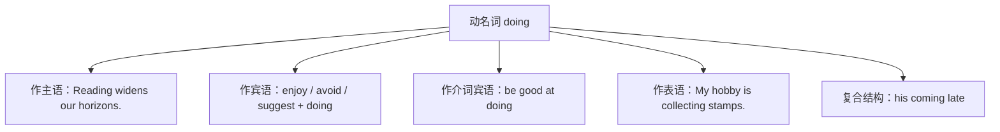

# Unit 2 Improving yourself · 语法与语言运用（Using language）

## 语法聚焦

本单元语法专题：**动名词（-ing forms）**。动名词兼具动词与名词的性质，可在句中作主语、宾语、表语、定语和介词宾语。与不定式相比，动名词更强调动作的**一般性、习惯性或已发生**，是语法填空和写作的高频考点。

## 用法梳理

| 功能 | 结构 | 例句 |
| --- | --- | --- |
| 主语 | Doing ... + 单数谓语 | Setting clear goals makes study efficient. 设定明确目标使学习高效。 |
| 宾语 | enjoy / avoid / practise / finish + doing | She practises speaking English every day. 她每天练习说英语。 |
| 介词宾语 | be interested in / insist on + doing | He insists on reviewing notes before bed. 他坚持睡前复习笔记。 |
| 表语 | be + doing（表内容） | His secret is keeping a study diary. 他的秘诀是记学习日记。 |
| 复合结构 | 物主代词/名词所有格 + doing | Do you mind my opening the window? 你介意我开窗吗？ |
| 被动式 | being done | Nobody likes being criticised in public. 没人喜欢被当众批评。 |
| 完成式 | having done | He regretted having wasted so much time. 他后悔浪费了那么多时间。 |

## 典型例句

1. **固定句型**：It is no use complaining. / There is no point (in) giving up now.
2. **be worth doing**：The book is well worth reading.（主动形式表被动意义）
3. **need/want/require doing**：Your study plan needs improving.（= needs to be improved）
4. **look forward to / be used to / devote ... to + doing**：介词 to 后接动名词，勿接原形。

## 易错点

1. remember/forget/regret + doing（已做过）与 + to do（要去做）意义不同：I regret wasting time.（后悔已浪费）vs. I regret to tell you...（遗憾地要告诉）。
2. look forward to / stick to / object to 中的 to 是介词，后接 doing。
3. 动名词作主语谓语用**单数**：Taking notes helps a lot.
4. avoid, suggest, consider, escape, delay 只接 doing，不接 to do。

## 背记要点

- 只接 doing 的动词口诀：考虑建议盼原谅（consider, suggest, expect... 中 suggest/avoid/enjoy/finish/practise/mind 必背）。
- 介词 to 三兄弟：look forward to / be used to / devote ... to + doing。
- 固定句型：It is no use doing / There is no point in doing / be worth doing。
- 高考视角：语法填空常考介词后填 doing、主语位置填 Doing。
- 写作加分句：Keeping a positive attitude is the first step to improving yourself.

## 自测题

1. 语法填空：We look forward to ______ (hear) from you soon.
2. 单选：The old dictionary is worth ______. A. to buy  B. buying  C. being bought  D. bought
3. 翻译：坚持每天锻炼帮助我克服了懒惰。（persist in; overcome）
4. 改错：Remember turning off the lights when you leave the classroom.

**答案**：1. hearing  2. B  3. Persisting in exercising every day helped me overcome laziness.  4. turning 改为 to turn（记得要去做）。

## 相关知识点

[[Unit 2 · 词汇与课文精读]] ｜ [[Unit 2 · 读写与表达]]
