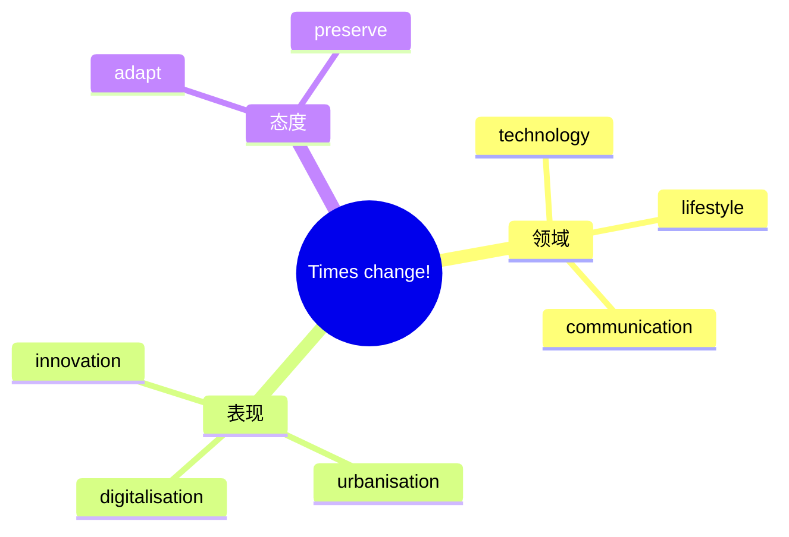

# Unit 3 Times change! · 词汇与课文精读（Understanding ideas）

## 主题导入

本单元主题为"时代变迁"（Times change!），课文围绕科技发展与社会变革展开，对比过去与现在的生活方式，思考变化带来的机遇与挑战。学习目标：掌握变迁主题词汇 15 个左右；理解"拥抱变化、传承精华"的主旨；剖析含分词结构与对比修辞的长难句。

## 核心词汇

| 单词 | 词性 | 释义 | 搭配例句 |
| --- | --- | --- | --- |
| transform | v. | 使改观 | Technology has transformed our daily life. 科技改变了我们的日常生活。 |
| revolution | n. | 变革 | the information revolution 信息革命。 |
| innovation | n. | 创新 | Innovation drives social progress. 创新推动社会进步。 |
| decade | n. | 十年 | Over the past decades, China has changed greatly. 过去几十年中国变化巨大。 |
| witness | v./n. | 见证 | The city has witnessed rapid development. 这座城市见证了快速发展。 |
| dramatic | adj. | 巨大的 | a dramatic change in lifestyle 生活方式的巨变。 |
| convenient | adj. | 便利的 | Mobile payment makes shopping convenient. 移动支付使购物便利。 |
| replace | v. | 取代 | E-books will not entirely replace paper books. 电子书不会完全取代纸质书。 |
| adapt | v. | 适应 | The elderly are learning to adapt to smart phones. 老年人在学着适应智能手机。 |
| preserve | v. | 保护；保存 | We should preserve traditional culture. 我们应保护传统文化。 |
| vanish | v. | 消失 | Many old crafts are vanishing. 许多老手艺正在消失。 |
| emerge | v. | 出现 | New industries keep emerging. 新产业不断涌现。 |
| generation | n. | 一代人 | the younger generation 年轻一代。 |
| urban | adj. | 城市的 | urban development 城市发展。 |
| era | n. | 时代 | We live in a digital era. 我们生活在数字时代。 |

## 短语与句型

1. **keep pace with**：与……并驾齐驱（Keep pace with the times.）
2. **in contrast to**：与……形成对比（In contrast to the past, travel is now much easier.）
3. **for the better**：向好的方向（Life has changed for the better.）
4. **Gone are the days when ...**：（Gone are the days when letters took weeks to arrive.）
5. **With the development of ...**：（With the development of technology, distance is no longer a barrier.）

## 课文理解要点

- 课文结构：今昔生活场景对比开篇（通讯、出行、购物）→ 分析变化的驱动力（科技、教育、政策）→ 讨论变化的双面性（便利与传统流失）→ 结论：既要拥抱变化，也要传承精华。
- 长难句：**Having witnessed the dramatic changes of the past decades, the older generation often reminds us that what is gained should not make us forget what might be lost.** 剖析：Having witnessed 为分词完成式作状语，逻辑主语是 the older generation；that 引导宾语从句，从句内含两个 what 引导的名词性从句。译：见证了过去几十年巨变的老一辈常提醒我们：所得不应让我们忘记可能失去的东西。
- 主旨：时代变迁不可逆转，理性的态度是主动适应并守护有价值的传统。

## 背记要点

- 高考视角：社会变迁与科技影响是北京卷阅读 C/D 篇高频话题。
- 必背搭配：keep pace with / adapt to / witness changes / for the better。
- 主旨句型：Gone are the days when ...（倒装句，写作亮点）。
- 写作加分句：With the development of technology, our life has changed dramatically.
- 区分：replace（取代）与 displace（迫使离开）语义不同。

## 自测题

1. 语法填空：Beijing has ______ (witness) great changes over the past forty years.
2. 单选：______ are the days when we had to queue for hours to buy tickets. A. Gone  B. Going  C. Go  D. Went
3. 翻译：随着科技的发展，许多传统手艺正在消失，我们应该保护它们。（with; vanish; preserve）
4. 写出 emerge、era 的中文含义并各造一句。

**答案**：1. witnessed  2. A  3. With the development of technology, many traditional crafts are vanishing, and we should preserve them.  4. 出现；时代（造句合理即可）

## 相关知识点

[[语法与语言运用（Using language）]] ｜ [[读写与表达（Developing ideas）]]
