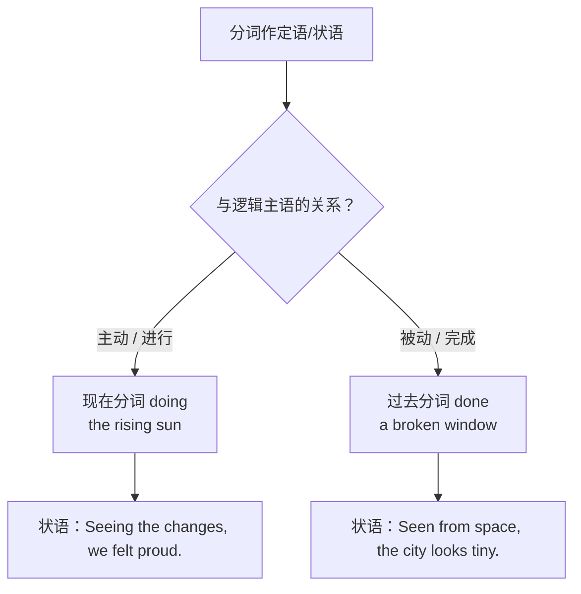

# Unit 3 Times change! · 语法与语言运用（Using language）

## 语法聚焦

本单元语法专题：**过去分词与现在分词作定语/状语**。分词是非谓语动词的重要形式：现在分词（doing）表**主动、进行**；过去分词（done）表**被动、完成**。判断的关键是分词与被修饰词（或句子主语）之间的逻辑关系。

## 用法梳理

| 功能 | 分词形式 | 例句 |
| --- | --- | --- |
| 前置定语 | doing / done | the developing countries 发展中国家；the developed countries 发达国家。 |
| 后置定语 | 分词短语 | The bridge built last year links the two districts. 去年建的桥连接两区。 |
| 时间状语 | doing / done | Walking in the old town, I noticed many changes. 走在老城，我注意到许多变化。 |
| 原因状语 | doing / done | Attracted by the new technology, many young people joined the company. 被新技术吸引，许多年轻人加入了公司。 |
| 结果状语 | doing（自然结果） | The high-speed railway opened, making travel much easier. 高铁开通，使出行更加便利。 |
| 伴随状语 | doing / done | She stood there, watching the city lights. 她站在那里，望着城市灯火。 |
| 完成式状语 | having done | Having lived here for decades, he knows every street. 在此住了几十年，他熟悉每条街。 |

## 典型例句

1. **区分情感分词**：The changes are amazing.（事物令人惊叹）/ We are amazed at the changes.(人感到惊叹)
2. **独立主格**：Time permitting, we will visit the museum of urban history.
3. **with 复合结构**：With so many new buildings rising, the skyline changes every year.
4. **状语位置灵活**：Compared with the past, life today is far more convenient.

## 易错点

1. 分词的逻辑主语必须与句子主语一致：Seen from the hill, the town looks beautiful.（town 被看）不能写成 Seeing from the hill, the town...。
2. having done 强调分词动作**先于**谓语动作；doing 表同时发生。
3. 不及物动词的过去分词表完成而非被动：fallen leaves（落了的叶）、the risen sun。
4. interested/interesting 类情感分词：-ed 修饰人，-ing 修饰物。

## 背记要点

- 口诀：主动进行用 doing，被动完成用 done。
- 判断三步：找逻辑主语 → 判断主被动 → 定分词形式。
- 高频前置定语：developing / developed, exciting / excited, boiling / boiled。
- 高考视角：语法填空给动词原形考分词，先看逻辑主语再定形式。
- 写作加分句：Seen from today's perspective, those changes were inevitable.

## 自测题

1. 语法填空：______ (compare) with the past, people now enjoy far more convenience.
2. 单选：The museum, ______ in 1959, has witnessed the city's growth. A. building  B. built  C. to build  D. being built
3. 翻译：走在焕然一新的街道上，老人回忆起了过去。（walk; recall）
4. 改错：Seeing from the plane, the new district looks like a garden.

**答案**：1. Compared  2. B  3. Walking along the renewed streets, the old man recalled the past.  4. Seeing 改为 Seen（district 被看，表被动）。

## 相关知识点

[[Unit 3 · 词汇与课文精读]] ｜ [[Unit 3 · 读写与表达]]
