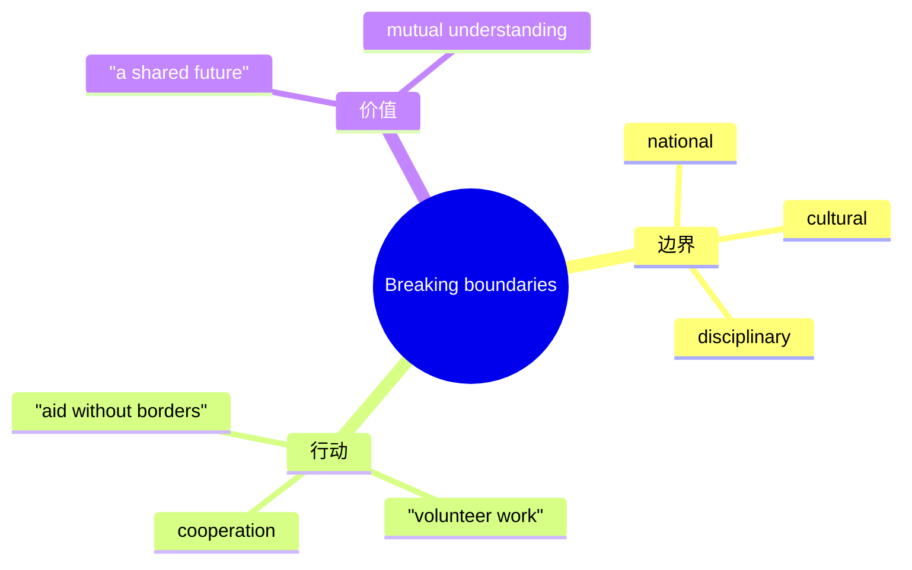

# Unit 4 Breaking boundaries · 词汇与课文精读（Understanding ideas）

## 主题导入

本单元主题为"打破边界"（Breaking boundaries），课文讲述国际合作、无国界救援与跨文化交流的故事，探讨人类如何跨越国界、偏见与学科的藩篱携手应对共同挑战。学习目标：掌握合作与跨越主题词汇 15 个左右；理解"人类命运休戚与共"的主旨；剖析含倒装与同位语从句的长难句。

## 核心词汇

| 单词 | 词性 | 释义 | 搭配例句 |
| --- | --- | --- | --- |
| boundary | n. | 边界；界限 | break down boundaries between nations 打破国家间的界限。 |
| cooperation | n. | 合作 | International cooperation is essential in fighting diseases. 抗击疾病离不开国际合作。 |
| volunteer | n./v. | 志愿者；自愿 | She volunteered to work in remote areas. 她自愿去偏远地区工作。 |
| commitment | n. | 奉献；承诺 | their commitment to saving lives 他们对拯救生命的执着。 |
| epidemic | n. | 流行病 | The doctors fought against the epidemic. 医生们抗击流行病。 |
| relief | n. | 救济；缓解 | provide disaster relief 提供灾害救援。 |
| barrier | n. | 障碍 | Language should not be a barrier to friendship. 语言不应成为友谊的障碍。 |
| mutual | adj. | 相互的 | mutual understanding and respect 相互理解与尊重。 |
| assistance | n. | 援助 | offer medical assistance 提供医疗援助。 |
| urgent | adj. | 紧急的 | respond to urgent needs 回应紧急需求。 |
| dedicate | v. | 奉献 | He dedicated his life to international aid. 他毕生致力于国际援助。 |
| overcome | v. | 克服 | overcome cultural barriers 克服文化障碍。 |
| crisis | n. | 危机 | face a global health crisis 面临全球健康危机。 |
| unite | v. | 团结 | The disaster united people around the world. 灾难使世界人民团结起来。 |
| humanity | n. | 人类；人道 | serve humanity beyond borders 跨越国界服务人类。 |

## 短语与句型

1. **break down barriers**：打破障碍（Sport breaks down barriers between cultures.）
2. **reach out to**：向……伸出援手（reach out to those in need）
3. **in the face of**：面对（In the face of the crisis, they stayed calm.）
4. **Not only ... but also ...**：（Not only did they offer medicine, but they also brought hope.）
5. **a community with a shared future**：（Building a community with a shared future for mankind.）

## 课文理解要点

- 课文结构：以一位无国界医生的经历开篇 → 描述艰苦环境与紧急救援场景 → 阐释志愿者的信念（humanity above borders）→ 升华：合作与奉献让世界更紧密。
- 长难句：**Never before had the young doctor realised that the belief that all lives are equal could carry him through such hardship.** 剖析：Never before 置于句首引起部分倒装（had ... realised）；第一个 that 引导宾语从句；the belief 后的 that all lives are equal 为同位语从句。译：这位年轻医生从未如此深刻地意识到，"生命平等"的信念能支撑他熬过这般艰辛。
- 主旨：打破国界与偏见的藩篱，以合作与奉献守护人类共同的福祉。

## 背记要点

- 高考视角：国际合作与志愿服务是北京卷阅读与书面表达的热点话题。
- 必背搭配：break down barriers / reach out to / in the face of / dedicate ... to。
- 主旨句型：Not only did they offer help, but they also brought hope.（倒装亮点句）
- 写作加分句：No boundary can stop people from helping one another.
- 区分：boundary（边界线）与 barrier（阻碍物）侧重不同。

## 自测题

1. 语法填空：Never before ______ (have) the world seen such large-scale cooperation.
2. 单选：Language differences should not become a ______ to communication. A. boundary  B. barrier  C. crisis  D. relief
3. 翻译：面对危机，各国医生跨越国界，向需要帮助的人伸出援手。（in the face of; reach out to）
4. 写出 dedicate、mutual 的中文含义并各造一句。

**答案**：1. has  2. B  3. In the face of the crisis, doctors from various countries crossed borders and reached out to those in need.  4. 奉献；相互的（造句合理即可）

## 相关知识点

[[Unit 4 · 语法与语言运用]] ｜ [[Unit 4 · 读写与表达]]
