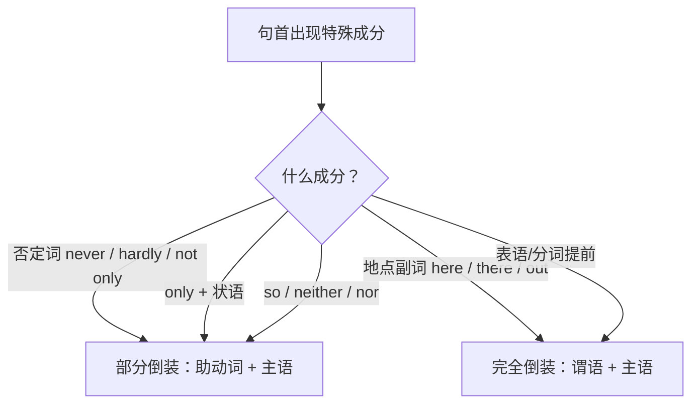

# Unit 4 Breaking boundaries · 语法与语言运用（Using language）

## 语法聚焦

本单元语法专题：**倒装（inversion）**。倒装分为**完全倒装**（谓语整体提前）与**部分倒装**（助动词提前）。倒装用于强调、平衡句子结构或满足语法要求，是北京高考单选、语法填空与写作亮点句的重要考点。

## 用法梳理

| 类型 | 触发条件 | 例句 |
| --- | --- | --- |
| 部分倒装 | 否定词开头：never, hardly, seldom, little | Never have I seen such devotion. 我从未见过这样的奉献。 |
| 部分倒装 | Not only ... but also ... | Not only did they donate money, but they also offered training. 他们不仅捐款还提供培训。 |
| 部分倒装 | Only + 状语（从句/短语） | Only through cooperation can we solve global problems. 只有通过合作才能解决全球问题。 |
| 部分倒装 | so/neither/nor 表"也/也不" | She volunteers regularly, and so does her brother. 她常做志愿，她弟弟也是。 |
| 部分倒装 | so/such ... that 的 so/such 提前 | So urgent was the situation that help arrived within hours. 情况紧急，救援数小时内赶到。 |
| 完全倒装 | 地点/方位副词开头 | Out rushed the rescue team. 救援队冲了出去。 |
| 完全倒装 | 表语/分词提前 | Standing by the border are volunteers from ten countries. 站在边境旁的是来自十国的志愿者。 |

## 典型例句

1. **Hardly ... when / No sooner ... than**：Hardly had the earthquake struck when rescuers set off.
2. **Only 修饰主语不倒装**：Only volunteers know the hardship.（Only + 主语，语序正常）
3. **Here/There 开头**：Here comes the medical team.（主语为名词时完全倒装；代词不倒装：Here it comes.）
4. **虚拟条件句省略 if 的倒装**：Had it not been for their help, many lives would have been lost.

## 易错点

1. Only 修饰**状语**才倒装；修饰主语不倒装。
2. 完全倒装中主语是**代词**时不倒装：Away he went.（不能 Away went he）。
3. Not only ... but also ... 只在 **not only 所在分句**倒装，but also 分句语序正常。
4. so + adj./adv. 提前引起部分倒装；such + n. 提前同理：Such was their courage that ...。

## 背记要点

- 判断口诀：否定 only 部分倒，方位表语完全倒，代词主语不许倒。
- 部分倒装公式：否定词/Only 状语 + 助动词 + 主语 + 谓语。
- 高频亮点句：Only in this way can we ... / Not only ... but also ...。
- 高考视角：单选常考 Only 状语倒装与 so...that 倒装；写作用倒装可提升档次。
- 虚拟倒装三兄弟：Were I ... / Had I done ... / Should it rain ...。

## 自测题

1. 语法填空：Only when we respect each other ______ (can) real cooperation begin.
2. 单选：______ the volunteers arrive than they started to work. A. Hardly had  B. No sooner had  C. Not until  D. Only when
3. 翻译：他们不仅带来了物资，还带来了希望。（Not only 倒装）
4. 改错：Only volunteers can understand the hardship, so does the local people.

**答案**：1. can  2. B  3. Not only did they bring supplies, but they also brought hope.  4. so does 改为 so can（助动词需与前句一致，且 people 为复数）。

## 相关知识点

[[词汇与课文精读（Understanding ideas）]] ｜ [[读写与表达（Developing ideas）]]
