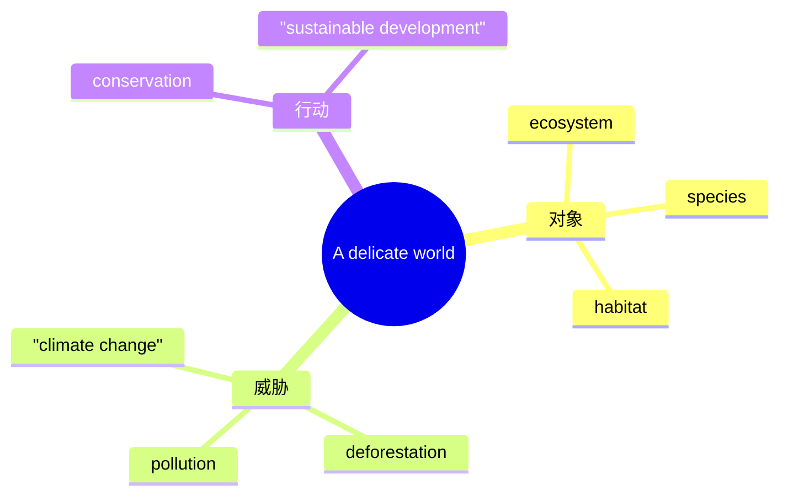

# Unit 5 A delicate world · 词汇与课文精读（Understanding ideas）

## 主题导入

本单元主题为"脆弱的自然"（A delicate world），课文聚焦生态平衡与生物多样性，讲述物种之间微妙的依存关系以及人类活动对自然的影响。学习目标：掌握生态主题词汇 15 个左右；理解"自然界环环相扣、牵一发而动全身"的主旨；剖析含虚拟语气与定语从句的长难句。

## 核心词汇

| 单词 | 词性 | 释义 | 搭配例句 |
| --- | --- | --- | --- |
| ecosystem | n. | 生态系统 | A wetland is a delicate ecosystem. 湿地是脆弱的生态系统。 |
| species | n. | 物种 | an endangered species 濒危物种。 |
| habitat | n. | 栖息地 | protect the natural habitat of pandas 保护大熊猫的自然栖息地。 |
| biodiversity | n. | 生物多样性 | Biodiversity keeps nature in balance. 生物多样性维持自然平衡。 |
| fragile | adj. | 脆弱的 | The polar environment is extremely fragile. 极地环境极其脆弱。 |
| extinct | adj. | 灭绝的 | Many species have become extinct. 许多物种已经灭绝。 |
| conservation | n. | 保护 | wildlife conservation 野生动物保护。 |
| pollute | v. | 污染 | Plastic waste pollutes the oceans. 塑料垃圾污染海洋。 |
| disturb | v. | 扰乱 | Human activities disturb the food chain. 人类活动扰乱食物链。 |
| interdependent | adj. | 相互依存的 | All living things are interdependent. 万物相互依存。 |
| consequence | n. | 后果 | The loss of bees has serious consequences. 蜜蜂消失后果严重。 |
| restore | v. | 恢复 | restore the damaged wetland 修复受损湿地。 |
| sustainable | adj. | 可持续的 | pursue sustainable development 追求可持续发展。 |
| vegetation | n. | 植被 | The vegetation here has been destroyed. 这里的植被已被破坏。 |
| awareness | n. | 意识 | raise public awareness of conservation 提高公众保护意识。 |

## 短语与句型

1. **in harmony with**：与……和谐相处（live in harmony with nature）
2. **die out**：灭绝（Without protection, the species would die out.）
3. **result in / result from**：导致 / 由……引起（Deforestation results in habitat loss.）
4. **It is high time that ...**：（It is high time that we took action to protect wildlife.）
5. **If ... were to ..., ... would ...**：（If bees were to disappear, crops would fail.）

## 课文理解要点

- 课文结构：以一个微小物种的消失开篇 → 揭示食物链的连锁反应（连带效应）→ 分析人类活动的影响（污染、砍伐、气候变化）→ 呼吁行动：与自然和谐共生。
- 长难句：**If this tiny creature were to vanish, the whole food chain that has taken millions of years to form would collapse like dominoes.** 剖析：If ... were to do 为对将来的虚拟假设；that has taken ... to form 为修饰 food chain 的定语从句；like dominoes 为比喻。译：倘若这种小生物消失，历经数百万年形成的整条食物链就会像多米诺骨牌一样崩塌。
- 主旨：自然界精妙而脆弱，人类必须敬畏并守护这种平衡。

## 背记要点

- 高考视角：生态保护是北京卷阅读与书面表达的常青话题。
- 必背搭配：in harmony with / die out / result in / raise awareness of。
- 主旨句型：It is high time that we took action.（虚拟语气亮点句）
- 写作加分句：All living things are interdependent; none can survive alone.
- 区分：extinct（已灭绝）与 endangered（濒危）程度不同。

## 自测题

1. 语法填空：It is high time that we ______ (take) measures to protect endangered species.
2. 单选：Cutting down forests will ______ the loss of many animals' habitats. A. result from  B. result in  C. restore  D. disturb
3. 翻译：如果蜜蜂消失，整个生态系统将会崩溃。（If ... were to; collapse）
4. 写出 fragile、interdependent 的中文含义并各造一句。

**答案**：1. took / should take  2. B  3. If bees were to disappear, the whole ecosystem would collapse.  4. 脆弱的；相互依存的（造句合理即可）

## 相关知识点

[[Unit 5 · 语法与语言运用]] ｜ [[Unit 5 · 读写与表达]]
