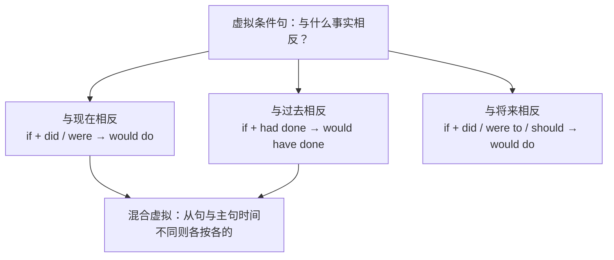

# Unit 5 A delicate world · 语法与语言运用（Using language）

## 语法聚焦

本单元语法专题：**虚拟语气（subjunctive mood）**。虚拟语气表示与事实相反的假设、不太可能实现的愿望或委婉的建议要求。核心是 if 虚拟条件句的三种时态对应，以及 wish、It is high time、建议要求类动词后的虚拟用法。

## 用法梳理

| 类型 | if 从句 | 主句 | 例句 |
| --- | --- | --- | --- |
| 与现在相反 | did / were | would/could/might do | If humans lived in harmony with nature, fewer species would die out. |
| 与过去相反 | had done | would have done | If we had acted earlier, the wetland would not have been destroyed. |
| 与将来相反 | did / were to do / should do | would do | If the glacier were to melt, sea levels would rise sharply. |
| wish 后 | 过去时/过去完成时 | — | I wish there were less plastic in the ocean. 但愿海里塑料少些。 |
| It is high time | (should) 过去时 | — | It is high time that we protected biodiversity. |
| 建议/要求/命令 | (should) + 动词原形 | — | Scientists suggest that the reserve (should) be expanded. |

## 典型例句

1. **省略 if 的倒装**：Were the forest to disappear, countless species would lose their homes. / Had we known the consequences, we would have acted differently.
2. **含蓄虚拟**：Without bees, many plants would fail to reproduce.（= If there were no bees）
3. **But for**：But for the conservation project, the crane would have died out.
4. **混合虚拟**：If the river had not been polluted, the fish would still be alive now.（从句与过去相反，主句与现在相反）

## 易错点

1. 与现在相反的虚拟中 be 动词一律用 **were**：If I were a scientist...。
2. suggest 表"建议"接 (should) do；表"表明"用陈述语气：The data suggests that the climate **is** changing.
3. 省略 if 时只有 were / had / should 可提前倒装。
4. It is high time that 后用**过去时**或 should do，不用原形。

## 背记要点

- 三对应口诀：现在 did，过去 had done，将来 were to/should do。
- 主句万能公式：would/could/might + (have) done。
- 倒装三词：Were / Had / Should 提到句首可省 if。
- 高考视角：语法填空与单选常考混合虚拟和 But for 含蓄虚拟。
- 写作加分句：Were everyone to make a small change, the world would be greener.

## 自测题

1. 语法填空：If we ______ (not cut) down the trees years ago, the birds would still be here now.
2. 单选：______ it not for the timely rescue, the whales would have died. A. Was  B. Were  C. Had  D. Should
3. 翻译：科学家建议立即扩大自然保护区。（suggest; (should) be expanded）
4. 改错：It is high time that we take action to reduce plastic waste.

**答案**：1. had not cut（混合虚拟）  2. B（Were it not for = But for）  3. Scientists suggest that the nature reserve (should) be expanded immediately.  4. take 改为 took 或 should take。

## 相关知识点

[[词汇与课文精读（Understanding ideas）]] ｜ [[读写与表达（Developing ideas）]]
