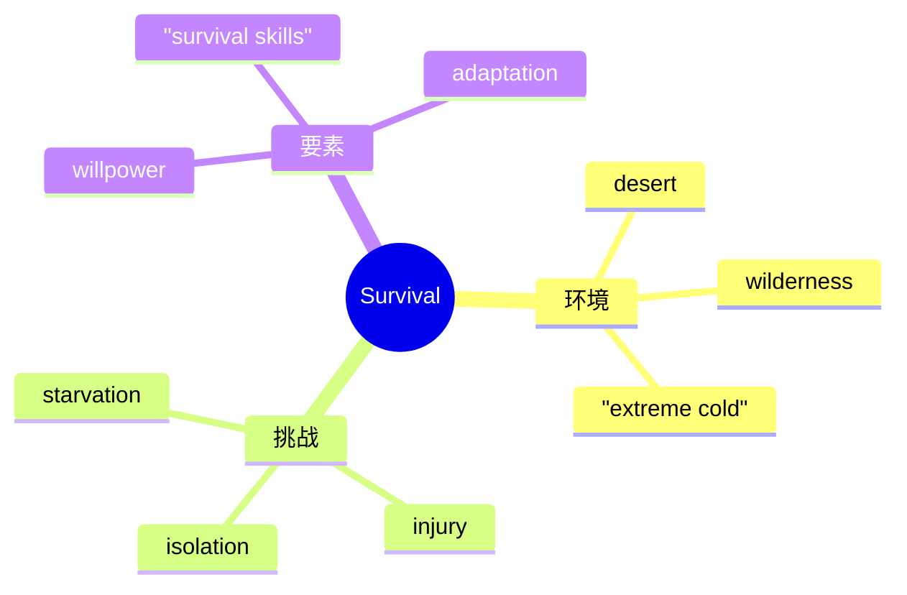

# Unit 6 Survival · 词汇与课文精读（Understanding ideas）

## 主题导入

本单元主题为"生存"（Survival），课文讲述人类与动物在极端环境中的生存故事，探讨生存智慧、意志力与自然法则。学习目标：掌握生存主题词汇 15 个左右；理解"生存既靠智慧与勇气，也靠对自然的敬畏"的主旨；剖析含省略结构与状语从句的长难句。

## 核心词汇

| 单词 | 词性 | 释义 | 搭配例句 |
| --- | --- | --- | --- |
| survival | n. | 生存 | the survival of the fittest 适者生存。 |
| survive | v. | 幸存 | He survived three days in the desert. 他在沙漠中撑过了三天。 |
| adapt | v. | 适应 | Camels have adapted to dry conditions. 骆驼已适应干旱环境。 |
| instinct | n. | 本能 | Animals rely on instinct to find food. 动物靠本能觅食。 |
| shelter | n./v. | 庇护所；躲避 | build a shelter from branches 用树枝搭庇护所。 |
| starvation | n. | 饥饿 | die of starvation 死于饥饿。 |
| desperate | adj. | 绝望的；不顾一切的 | a desperate struggle for survival 为生存的殊死搏斗。 |
| endurance | n. | 忍耐力 | The journey tested his endurance. 旅程考验了他的耐力。 |
| rescue | n./v. | 营救 | A rescue team arrived at dawn. 救援队黎明时赶到。 |
| threat | n. | 威胁 | Wild animals face constant threats. 野生动物面临持续威胁。 |
| extreme | adj. | 极端的 | survive in extreme conditions 在极端环境中生存。 |
| injure | v. | 使受伤 | The climber was badly injured. 登山者受了重伤。 |
| calm | adj./v. | 镇静的 | Staying calm is the first rule of survival. 保持冷静是生存第一法则。 |
| resource | n. | 资源 | make full use of limited resources 充分利用有限资源。 |
| determination | n. | 决心 | Sheer determination kept him alive. 纯粹的意志力让他活了下来。 |

## 短语与句型

1. **run out of**：用完（They ran out of food and water.）
2. **hold on**：坚持住（Hold on until help arrives.）
3. **at the mercy of**：任凭……摆布（The sailors were at the mercy of the storm.）
4. **When in danger, ...**：（When in danger, stay calm first.）省略句式
5. **What kept him alive was ...**：（What kept him alive was his determination.）

## 课文理解要点

- 课文结构：极端环境中的遇险开篇（风暴/沙漠/雪山）→ 描写生存困境（断水断粮、受伤、孤立无援）→ 展现生存智慧（就地取材、保持冷静、发出信号）→ 获救与反思：敬畏自然、珍视生命。
- 长难句：**Though badly injured and running out of supplies, he refused to give up, believing that as long as he stayed calm, rescue would come.** 剖析：Though badly injured 为省略结构（= Though he was badly injured）；believing... 为现在分词作伴随状语；as long as 引导条件状语从句。译：尽管伤势严重、补给将尽，他拒绝放弃，坚信只要保持冷静，救援终会到来。
- 主旨：生存考验的不仅是体力与技能，更是冷静的头脑与不屈的意志。

## 背记要点

- 高考视角：野外生存与救援故事是北京卷完形填空和读后续写的常见素材。
- 必背搭配：run out of / at the mercy of / hold on / adapt to。
- 主旨句型：What kept him alive was his determination.（主语从句亮点）
- 写作加分句：Staying calm is the first rule of survival.
- 区分：injure（受伤）、wound（刀枪伤）、hurt（泛指伤痛）。

## 自测题

1. 语法填空：______ (face) with the storm, the sailors remained calm and worked together.
2. 单选：They were lost in the mountains and soon ______ food. A. ran out  B. ran out of  C. used up of  D. gave out of
3. 翻译：让他活下来的是他的决心和生存技能。（What ... was ...）
4. 写出 instinct、endurance 的中文含义并各造一句。

**答案**：1. Faced  2. B  3. What kept him alive was his determination and survival skills.  4. 本能；忍耐力（造句合理即可）

## 相关知识点

[[Unit 6 · 语法与语言运用]] ｜ [[Unit 6 · 读写与表达]]
