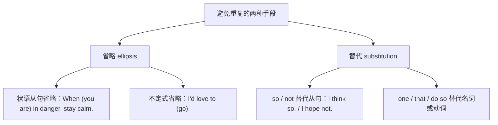

# Unit 6 Survival · 语法与语言运用（Using language）

## 语法聚焦

本单元语法专题：**省略（ellipsis）与替代**。为避免重复、使表达简洁，英语常省略句中可由上下文补足的成分（状语从句的主语和 be 动词、不定式的动词部分等），或用 so / do so / one / that 等词替代前文内容。这是阅读长难句和写作简洁化的关键。

## 用法梳理

| 类型 | 规则 | 例句 |
| --- | --- | --- |
| 状语从句省略 | 从句主语与主句一致且含 be 时，省"主语 + be" | While (he was) exploring the cave, he found a spring. 探洞时他发现了泉水。 |
| when/if/unless + 分词或形容词 | 同上 | If (it is) necessary, light a fire for warmth. 必要时生火取暖。 |
| 不定式省略 | 保留 to，省动词 | —Will you join the rescue? —I'd be glad to. 我很乐意（参加）。 |
| so/not 替代宾语从句 | think/believe/hope/be afraid 后 | —Will they survive? —I believe so. / I'm afraid not. |
| one(s) 替代可数名词 | 泛指同类 | My torch is broken; I need a new one. 我需要一个新手电。 |
| that/those 替代特指名词 | 常用于比较 | The climate here is harsher than that of the plains. 这里的气候比平原的恶劣。 |
| do so / do it 替代动词短语 | 避免重复动作 | He promised to send a signal and he did so at dawn. 他黎明时发出了信号。 |

## 典型例句

1. **祈使句中的省略**：When in doubt, follow your instinct.（= When you are in doubt）
2. **比较结构省略**：Some animals adapt faster than others (do).
3. **省 to 的场合**：动词 be 后需保留完整：—Is he a survivor? —He seems to be.（不能只留 to）
4. **并列句省略**：He carried the water and (he carried) the map.

## 易错点

1. 状语从句省略的前提：从句主语与主句主语**一致**且从句含 be 动词，二者缺一不可。
2. 替代不可数名词不用 one，用 that：The water here is cleaner than that in the pond.
3. I'd love to（省 go 等动词）中的 to 不能再省；但 be 动词须保留：hope to be。
4. so 替代肯定从句，not 替代否定从句：I hope so. / I hope not.（不说 I don't hope so）。

## 背记要点

- 省略口诀：主语一致有 be 动，主语加 be 一起省。
- 替代三件套：one（可数泛指）、that/those（特指比较）、do so（动词短语）。
- 应答省略：I'd be glad to. / I believe so. / I'm afraid not.
- 高考视角：单选和语法填空常考 that/one 辨析与状语从句省略后的分词形式。
- 写作提示：善用省略与替代可使行文简洁，避免重复扣分。

## 自测题

1. 语法填空：When ______ (attack), the hedgehog rolls itself into a ball.
2. 单选：The weather in the mountains is much colder than ______ at the foot. A. one  B. that  C. it  D. this
3. 翻译：——你会参加急救培训吗？——我很乐意。（I'd be glad to）
4. 改错：—Do you think they will find water? —I don't hope so.

**答案**：1. attacked（= When it is attacked）  2. B  3. —Will you attend the first-aid training? —I'd be glad to.  4. 改为 I hope not.（否定从句用 not 替代）。

## 相关知识点

[[词汇与课文精读（Understanding ideas）]] ｜ [[读写与表达（Developing ideas）]]
