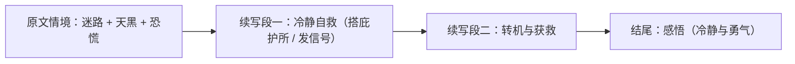

# Unit 6 Survival · 读写与表达（Developing ideas）

## 读写任务

本课围绕"生存与救援"展开读写训练。阅读文本讲述一次野外遇险与自救的完整经历；写作任务为读后续写：**给出遇险故事开头（登山迷路、天色渐暗），续写两段——自救过程与获救结局**，要求情节合理、动作与心理描写细腻、与原文情感线衔接。

## 写作模板与句式

**段一开头（承接原文，稳定情绪）**
- Fighting back the rising panic, I forced myself to think clearly.
- "Stay calm," I whispered to myself, remembering what the survival guide said.

**自救动作链（动作描写）**
- I gathered dry branches, built a simple shelter and marked my position with bright clothes.
- With trembling hands, I lit a small fire, hoping the smoke would catch someone's attention.

**段二开头（转机出现）**
- Just as despair began to creep in, a faint sound of a helicopter broke the silence.
- At that very moment, a beam of light swept across the trees.

**获救与感悟（升华）**
- Wrapped in a warm blanket, I burst into tears of relief and gratitude.
- This experience taught me that staying calm, rather than physical strength, is the real key to survival.

**心理描写句式**
- My heart sank / raced / leapt with joy. / A wave of relief washed over me.

## 范文提纲

**题目**：Lost on the Mountain（读后续写）

1. **续写段一**：压住恐慌，回忆生存常识；行动链——搭庇护所、生火、留标记（build a shelter; light a fire; mark the position）；心理——恐惧与希望交织。
2. **续写段二**：直升机声音出现（a faint sound broke the silence）；挥动衣物呼救；获救后的情感爆发（tears of relief）；感悟收束——冷静与勇气是生存关键（呼应原文主题）。

## 背记要点

- 续写两段功能：段一"自救行动链"，段二"转机 + 获救 + 升华"。
- 动作链三步：gather — build — light（连贯动词提升画面感）。
- 心理线贯穿：panic → hope → relief，与原文情感衔接。
- 高考视角：北京卷读后续写重情节合理与语言质量，避免超自然巧合。
- 升华句：Staying calm, rather than strength, is the real key to survival.

## 自测题

1. 写出两个描写"恐慌中让自己冷静"的句子。
2. 用三个连贯动词写一个自救动作链句子。
3. 写一个"转机出现"的段落开头句。
4. 写出获救后表达情感与感悟的两个句式。

**答案**：1. 如 Fighting back the panic, I forced myself to think. / "Stay calm," I told myself.  2. 如 I gathered branches, built a shelter and lit a fire.  3. 如 Just as despair crept in, a helicopter sound broke the silence.  4. A wave of relief washed over me. / This experience taught me that ...

## 相关知识点

[[Unit 6 · 词汇与课文精读]] ｜ [[Unit 6 · 语法与语言运用]]
