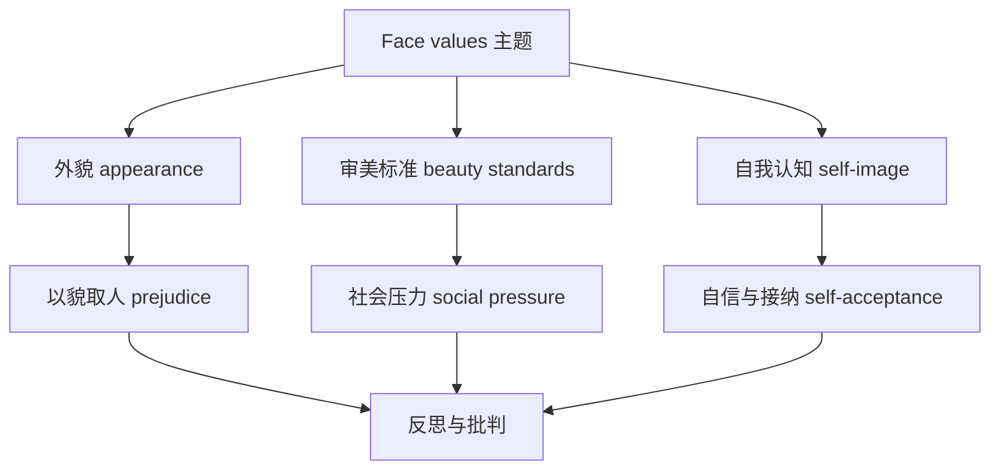

# 词汇与课文精读（Understanding ideas）

## 核心概念 / 课标要求
- 本课为外研版选择性必修第三册 Unit 1 Face values 的 Understanding ideas 部分，主题为"外貌与价值观"。
- 课标要求：理解课文主旨，掌握与外貌、审美、自我认知相关的核心词汇，把握议论文的论证结构。
- 主题：探讨外貌在人际交往与自我认知中的作用，反思"以貌取人"的偏见。

## 知识梳理

| 类别 | 核心词汇 | 用法 |
|------|---------|------|
| 外貌 | appearance, feature, figure, complexion | appearance 指外表，feature 指特征 |
| 审美 | beauty, aesthetic, standard, ideal | aesthetic 为形容词"审美的" |
| 认知 | perception, self-image, identity | perception 指感知、看法 |
| 态度 | judge, prejudice, stereotype | stereotype 指刻板印象 |

## 重点探究
1. **课文主旨**：课文通过讨论外貌在生活中的作用，批判"以貌取人"的偏见，倡导接纳自我、重视内在价值，论证外貌与价值观的关系。
2. **核心词汇辨析**：appearance（外表）与 feature（特征）不同；perception（感知）与 opinion（观点）不同；stereotype（刻板印象）含贬义，指对群体的固化看法。
3. **论证结构**：课文采用"提出问题—分析现象—批判反思"的议论文结构，先引出外貌话题，再分析社会审美标准，最后倡导自我接纳。

## 易错点
- appearance 与 look 的区别：appearance 较正式，look 较口语。
- stereotype 是"刻板印象"，含贬义，勿与 type（类型）混淆。
- aesthetic 是形容词"审美的"，勿误用为名词。
- "以貌取人"译为 judge by appearance，勿直译。

## 背记要点
1. appearance 外表，feature 特征，figure 身材。
2. aesthetic 审美的，perception 感知，identity 身份。
3. stereotype 刻板印象，prejudice 偏见。
4. 课文批判"以貌取人"，倡导自我接纳。
5. 议论文结构：提出问题—分析—批判反思。
6. self-image 自我形象，self-acceptance 自我接纳。

## 自测题
1. 用英语解释 appearance 与 feature 的区别。
2. 课文的主旨是什么？
3. 列举三个与外貌相关的核心词汇。
4. 议论文的论证结构是怎样的？
5. 翻译"以貌取人"并造句。

## 相关知识点
- 关联 Unit 1 语法（Using language）与读写（Developing ideas）。
- 主题与"自我认知""社会审美"话题相关。
- 为高考英语议论文阅读与写作奠定基础。
