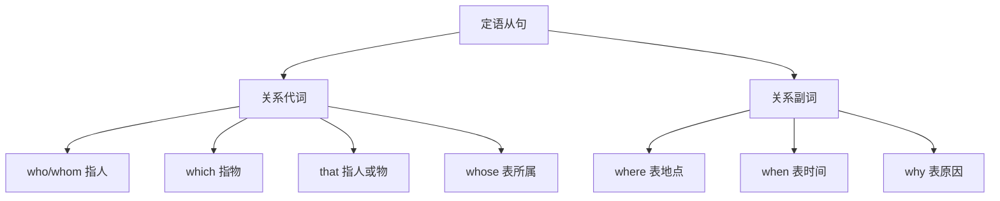

# 语法与语言运用（Using language）

## 核心概念 / 课标要求
- 本课为外研版选择性必修第三册 Unit 1 Face values 的 Using language 部分，主题为"外貌与价值观"。
- 课标要求：掌握本单元核心语法——定语从句（Attributive Clauses），并能运用于表达与写作。
- 语法重点：关系代词（who, whom, whose, which, that）与关系副词（where, when, why）引导的定语从句。

## 知识梳理

| 关系词 | 先行词 | 在从句中的作用 | 例句 |
|--------|--------|--------------|------|
| who/whom | 人 | 主语/宾语 | The girl who is tall... |
| whose | 人/物 | 定语 | The man whose face... |
| which | 物 | 主语/宾语 | The standard which... |
| that | 人/物 | 主语/宾语 | The idea that... |
| where | 地点 | 状语 | The place where... |
| when | 时间 | 状语 | The time when... |

## 重点探究
1. **关系代词的选择**：先行词指人用 who/whom，指物用 which，两者皆可用 that；表所属用 whose。关系代词在从句中作主语或宾语。
2. **关系副词的选择**：先行词表地点用 where，表时间用 when，表原因用 why。关系副词在从句中作状语。
3. **限制性与非限制性**：限制性定语从句与先行词关系紧密，无逗号；非限制性定语从句有逗号，不能用 that，指人用 who，指物用 which。

## 易错点
- 非限制性定语从句不能用 that，指人用 who，指物用 which。
- 关系代词作宾语时可省略，作主语不可省略。
- whose 表所属，勿与 who's（who is）混淆。
- 先行词是"人+物"时只能用 that。

## 背记要点
1. 指人用 who/whom，指物用 which，两者皆可用 that。
2. whose 表所属，作定语。
3. where 表地点，when 表时间，why 表原因。
4. 非限制性定语从句不能用 that。
5. 关系代词作宾语可省略。
6. 先行词是"人+物"时只能用 that。

## 自测题
1. 用 who/which/that 各造一个定语从句。
2. 非限制性定语从句为什么不能用 that？
3. 关系代词作宾语时能否省略？
4. 用 where 和 when 各造一个定语从句。
5. 改正：The man which is tall is my teacher.

## 相关知识点
- 关联 Unit 1 词汇（Understanding ideas）与读写（Developing ideas）。
- 定语从句是高考英语语法重点。
- 与名词性从句、状语从句共同构成复合句体系。
