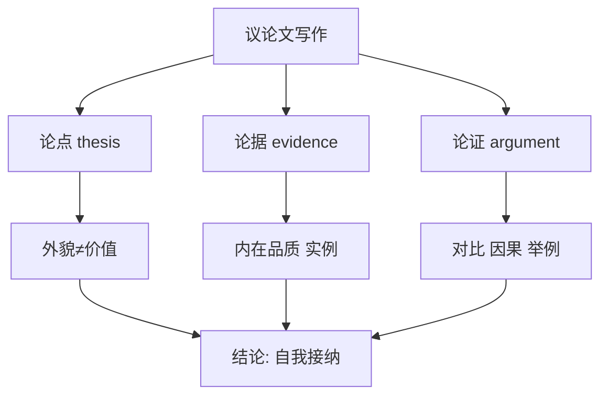

# 读写与表达（Developing ideas）

## 核心概念 / 课标要求
- 本课为外研版选择性必修第三册 Unit 1 Face values 的 Developing ideas 部分，主题为"外貌与价值观"。
- 课标要求：通过读写训练，提升议论文写作与观点表达能力，学会围绕"外貌与自我认知"展开论述。
- 写作重点：议论文的论点、论据与论证，以及表达观点的高级句式。

## 知识梳理

| 写作要素 | 内容 | 表达句式 |
|---------|------|---------|
| 论点 | 外貌不应决定自我价值 | In my opinion... |
| 论据 | 内在品质比外貌更重要 | It is ... that ... |
| 论证 | 举例、对比、因果 | For example... |
| 结论 | 倡导自我接纳 | In conclusion... |

## 重点探究
1. **议论文结构**：议论文通常包括引言（提出论点）、主体（论证）、结论（总结观点）。围绕"外貌与价值观"主题，可先提出"外貌不应决定自我价值"的论点，再以实例论证。
2. **高级句式**：运用强调句"It is ... that ..."、定语从句、倒装句等提升表达层次，如"It is inner quality that truly matters"。
3. **观点表达**：学会用 In my opinion, From my perspective, It is widely believed that 等句式表达观点，使论述更有说服力。

## 易错点
- 议论文要有明确的论点，勿只罗列事实。
- 论据要具体，勿空泛。
- 强调句"It is ... that ..."中 that 不可省略。
- 观点表达要客观，勿过于绝对。

## 背记要点
1. 议论文结构：引言—主体—结论。
2. 论点要明确，论据要具体。
3. 强调句 It is ... that ... 提升表达。
4. In my opinion / From my perspective 表达观点。
5. 论证方法：举例、对比、因果。
6. 结论要总结观点，倡导自我接纳。

## 自测题
1. 议论文的基本结构是什么？
2. 用强调句写一个关于内在品质的句子。
3. 列举三个表达观点的句式。
4. 围绕"外貌与价值"写一个论点。
5. 论证方法有哪些？

## 相关知识点
- 关联 Unit 1 词汇与语法（Understanding ideas / Using language）。
- 议论文写作是高考英语写作重点。
- 与"自我认知""社会审美"话题相关。
