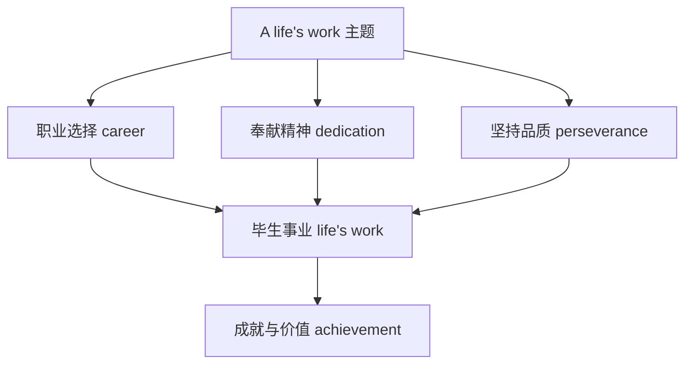

# 词汇与课文精读（Understanding ideas）

## 核心概念 / 课标要求
- 本课为外研版选择性必修第三册 Unit 2 A life's work 的 Understanding ideas 部分，主题为"毕生的事业"。
- 课标要求：理解课文主旨，掌握与职业、奉献、坚持相关的核心词汇，把握人物传记的叙事结构。
- 主题：探讨一个人如何以毕生精力投入一项事业，体现坚持与奉献精神。

## 知识梳理

| 类别 | 核心词汇 | 用法 |
|------|---------|------|
| 职业 | career, profession, occupation | career 指职业生涯 |
| 奉献 | devote, dedicate, commitment | devote ... to 献身于 |
| 坚持 | persist, perseverance, determination | persist in 坚持 |
| 成就 | achievement, accomplishment | achievement 指成就 |

## 重点探究
1. **课文主旨**：课文通过讲述某人以毕生精力投入一项事业的故事，展现坚持、奉献与热爱的精神，探讨"毕生的事业"的价值与意义。
2. **核心词汇辨析**：career（职业生涯）与 job（工作）不同；devote（献身）与 dedicate（奉献）近义；persist（坚持）与 insist（坚持主张）不同。
3. **人物传记结构**：课文采用"引入人物—叙述经历—突出品质—总结意义"的传记结构，通过具体事例塑造人物形象。

## 易错点
- career 指职业生涯，job 指具体工作，勿混淆。
- devote ... to 中 to 是介词，后接名词或动名词。
- persist in 坚持做，insist on 坚持主张，勿混淆。
- achievement 是可数名词"成就"，勿误用。

## 背记要点
1. career 职业生涯，profession 职业，occupation 职业。
2. devote/dedicate 献身，commitment 承诺、投入。
3. persist 坚持，perseverance 毅力，determination 决心。
4. 课文展现坚持与奉献精神。
5. 人物传记结构：引入—经历—品质—意义。
6. devote ... to 献身于。

## 自测题
1. 用英语解释 career 与 job 的区别。
2. 课文的主旨是什么？
3. 列举三个与奉献相关的核心词汇。
4. 人物传记的叙事结构是怎样的？
5. 用 devote ... to 造句。

## 相关知识点
- 关联 Unit 2 语法（Using language）与读写（Developing ideas）。
- 主题与"职业规划""人生价值"话题相关。
- 为高考英语人物传记阅读奠定基础。
