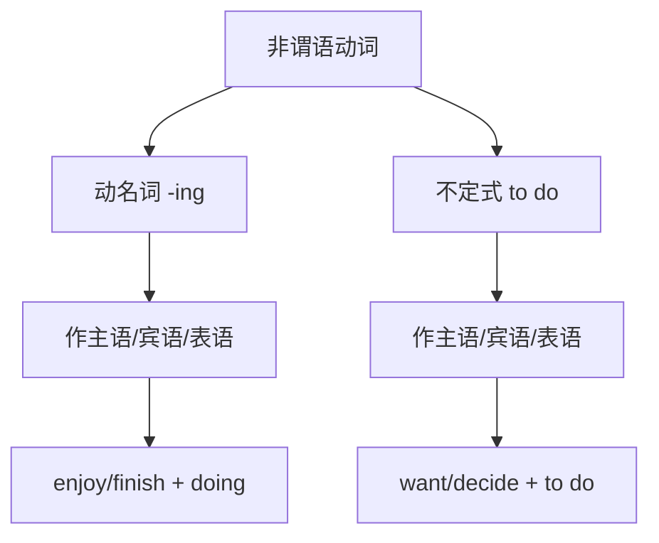

# 语法与语言运用（Using language）

## 核心概念 / 课标要求
- 本课为外研版选择性必修第三册 Unit 2 A life's work 的 Using language 部分，主题为"毕生的事业"。
- 课标要求：掌握本单元核心语法——非谓语动词（Non-finite Verbs）中的动名词与不定式，并能运用于表达。
- 语法重点：动名词（-ing）与不定式（to do）作主语、宾语、表语的用法。

## 知识梳理

| 形式 | 作主语 | 作宾语 | 作表语 |
|------|--------|--------|--------|
| 动名词 -ing | Devoting oneself is... | enjoy devoting | My job is teaching |
| 不定式 to do | To persist is... | want to persist | My goal is to succeed |

## 重点探究
1. **动名词与不定式作主语**：动名词作主语表示一般性、习惯性动作，不定式作主语表示具体、一次性动作，如"Devoting oneself to work is admirable"与"To persist is important"。
2. **动名词与不定式作宾语**：enjoy, finish, avoid 等动词后接动名词；want, decide, hope 等动词后接不定式。部分动词（如 remember, forget）后接两者意义不同。
3. **动名词与不定式作表语**：动名词作表语表示一般性内容，不定式作表语表示具体目标，如"My job is teaching"与"My goal is to succeed"。

## 易错点
- enjoy, finish, avoid 后接动名词，勿接不定式。
- want, decide, hope 后接不定式，勿接动名词。
- remember doing 记得做过，remember to do 记得去做。
- 动名词作主语表示一般性，不定式表示具体性。

## 背记要点
1. 动名词 -ing 作主语表示一般性动作。
2. 不定式 to do 作主语表示具体动作。
3. enjoy/finish/avoid + doing。
4. want/decide/hope + to do。
5. remember doing 与 remember to do 意义不同。
6. 动名词与不定式均可作表语。

## 自测题
1. 用动名词和不定式各造一个作主语的句子。
2. enjoy 后接什么形式？
3. remember doing 与 remember to do 有何区别？
4. 用 want to do 造句。
5. 改正：I enjoy to read books.

## 相关知识点
- 关联 Unit 2 词汇（Understanding ideas）与读写（Developing ideas）。
- 非谓语动词是高考英语语法重点。
- 与定语从句、名词性从句共同构成语法体系。
