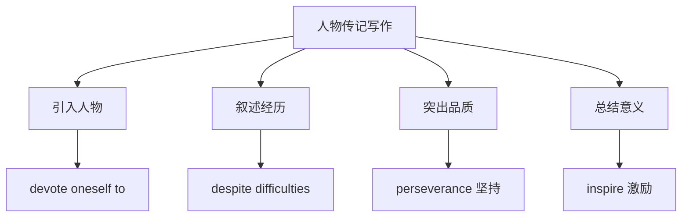

# 读写与表达（Developing ideas）

## 核心概念 / 课标要求
- 本课为外研版选择性必修第三册 Unit 2 A life's work 的 Developing ideas 部分，主题为"毕生的事业"。
- 课标要求：通过读写训练，提升人物传记写作与观点表达能力，学会围绕"毕生的事业"展开叙述与论述。
- 写作重点：人物传记的叙事结构，以及表达坚持、奉献精神的高级句式。

## 知识梳理

| 写作要素 | 内容 | 表达句式 |
|---------|------|---------|
| 引入 | 介绍人物与事业 | He devoted himself to... |
| 经历 | 叙述奋斗历程 | Despite difficulties, he... |
| 品质 | 突出坚持与奉献 | It was his perseverance that... |
| 意义 | 总结价值 | His work has inspired... |

## 重点探究
1. **人物传记结构**：人物传记通常包括引入（介绍人物与事业）、经历（叙述奋斗历程）、品质（突出坚持与奉献）、意义（总结价值）四部分，通过具体事例塑造人物。
2. **高级句式**：运用"devote oneself to""It was ... that ..."强调句、非谓语动词等提升表达，如"It was his perseverance that led to success"。
3. **观点表达**：学会用 Despite difficulties, Thanks to his dedication 等句式表达坚持与奉献，使叙述更有感染力。

## 易错点
- 人物传记要有具体事例，勿只空谈品质。
- devote oneself to 中 to 是介词，后接名词或动名词。
- 强调句 It was ... that ... 中 that 不可省略。
- 叙述要按时间顺序，勿混乱。

## 背记要点
1. 人物传记结构：引入—经历—品质—意义。
2. devote oneself to 献身于。
3. Despite difficulties 尽管困难。
4. 强调句 It was ... that ... 突出品质。
5. 用具体事例塑造人物。
6. 总结价值，激励读者。

## 自测题
1. 人物传记的基本结构是什么？
2. 用 devote oneself to 写一个句子。
3. 用强调句突出"坚持"这一品质。
4. 围绕"毕生的事业"写一个引入段。
5. 如何使人物传记更有感染力？

## 相关知识点
- 关联 Unit 2 词汇与语法（Understanding ideas / Using language）。
- 人物传记写作是高考英语写作重点。
- 与"职业规划""人生价值"话题相关。
