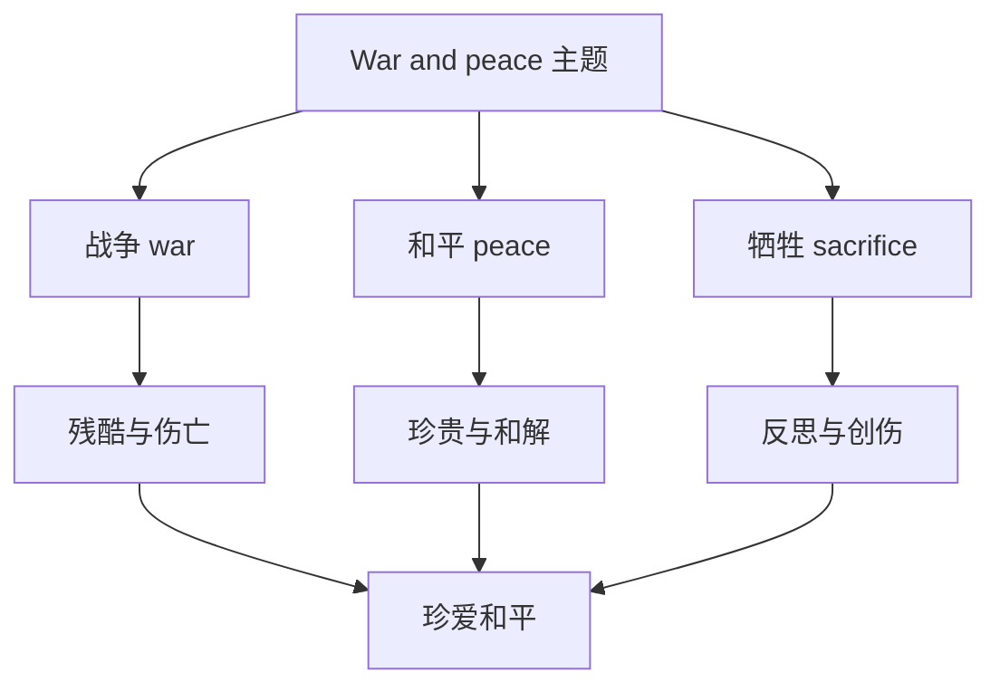

# 词汇与课文精读（Understanding ideas）

## 核心概念 / 课标要求
- 本课为外研版选择性必修第三册 Unit 3 War and peace 的 Understanding ideas 部分，主题为"战争与和平"。
- 课标要求：理解课文主旨，掌握与战争、和平、牺牲相关的核心词汇，把握历史叙事与议论的结构。
- 主题：探讨战争的残酷与和平的珍贵，反思战争对人类的伤害。

## 知识梳理

| 类别 | 核心词汇 | 用法 |
|------|---------|------|
| 战争 | war, battle, conflict, invasion | conflict 指冲突 |
| 和平 | peace, ceasefire, reconciliation | reconciliation 指和解 |
| 牺牲 | sacrifice, casualty, victim | casualty 指伤亡 |
| 反思 | reflect, consequence, trauma | consequence 指后果 |

## 重点探究
1. **课文主旨**：课文通过叙述战争的历史事件或人物经历，展现战争的残酷与牺牲，反思战争的后果，倡导珍爱和平。
2. **核心词汇辨析**：war（战争）与 battle（战役）不同；conflict（冲突）范围更广；sacrifice（牺牲）与 casualty（伤亡）不同，casualty 指伤亡人员。
3. **历史叙事结构**：课文采用"背景—事件—影响—反思"的结构，通过具体史实与人物故事，引发对战争与和平的思考。

## 易错点
- war 指战争，battle 指战役，勿混淆。
- casualty 指伤亡人员，victim 指受害者，勿混淆。
- conflict 是"冲突"，范围比 war 广。
- reconciliation 是"和解"，勿误用。

## 背记要点
1. war 战争，battle 战役，conflict 冲突。
2. peace 和平，ceasefire 停火，reconciliation 和解。
3. sacrifice 牺牲，casualty 伤亡，victim 受害者。
4. 课文反思战争，倡导珍爱和平。
5. 历史叙事结构：背景—事件—影响—反思。
6. consequence 后果，trauma 创伤。

## 自测题
1. 用英语解释 war 与 battle 的区别。
2. 课文的主旨是什么？
3. 列举三个与和平相关的核心词汇。
4. 历史叙事的结构是怎样的？
5. 用 sacrifice 造句。

## 相关知识点
- 关联 Unit 3 语法（Using language）与读写（Developing ideas）。
- 主题与"战争与和平""历史反思"话题相关。
- 为高考英语历史类阅读奠定基础。
