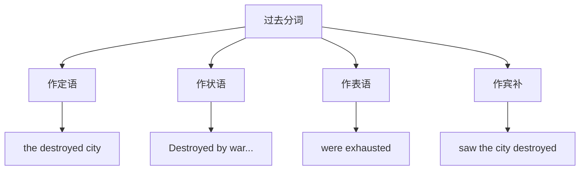

# 语法与语言运用（Using language）

## 核心概念 / 课标要求
- 本课为外研版选择性必修第三册 Unit 3 War and peace 的 Using language 部分，主题为"战争与和平"。
- 课标要求：掌握本单元核心语法——过去分词（Past Participles）作定语、状语、表语的用法，并能运用于表达。
- 语法重点：过去分词表示被动或完成，作定语、状语、表语。

## 知识梳理

| 功能 | 用法 | 例句 |
|------|------|------|
| 作定语 | 表示被动或完成 | the destroyed city |
| 作状语 | 表示时间、原因、条件 | Destroyed by war, the city... |
| 作表语 | 表示状态 | The soldiers were exhausted |
| 作宾补 | 表示被动 | We saw the city destroyed |

## 重点探究
1. **过去分词作定语**：过去分词作定语表示被动或完成，如"the destroyed city"（被毁的城市），相当于定语从句"the city that was destroyed"。
2. **过去分词作状语**：过去分词作状语表示时间、原因、条件等，逻辑主语与句子主语一致，如"Destroyed by war, the city lay in ruins"。
3. **过去分词作表语与宾补**：作表语表示状态，如"The soldiers were exhausted"；作宾补表示被动，如"We saw the city destroyed"。

## 易错点
- 过去分词表示被动或完成，现在分词表示主动或进行。
- 过去分词作状语时，逻辑主语须与句子主语一致。
- 作表语表示状态，勿与被动语态混淆。
- 过去分词作定语可相当于定语从句。

## 背记要点
1. 过去分词表示被动或完成。
2. 作定语：the destroyed city。
3. 作状语：Destroyed by war, ...
4. 作表语：were exhausted。
5. 作宾补：saw the city destroyed。
6. 过去分词与现在分词的区别。

## 自测题
1. 用过去分词作定语造一个句子。
2. 过去分词作状语表示什么？
3. 过去分词与现在分词有何区别？
4. 用过去分词作表语造句。
5. 改正：The city destroying by war is in ruins.

## 相关知识点
- 关联 Unit 3 词汇（Understanding ideas）与读写（Developing ideas）。
- 过去分词是高考英语语法重点。
- 与现在分词、非谓语动词共同构成语法体系。
