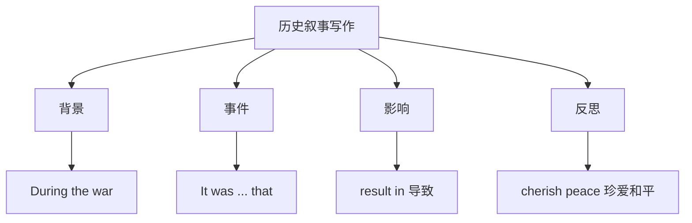

# 读写与表达（Developing ideas）

## 核心概念 / 课标要求
- 本课为外研版选择性必修第三册 Unit 3 War and peace 的 Developing ideas 部分，主题为"战争与和平"。
- 课标要求：通过读写训练，提升历史叙事与观点表达能力，学会围绕"战争与和平"展开论述。
- 写作重点：历史叙事的结构，以及表达反思与呼吁和平的高级句式。

## 知识梳理

| 写作要素 | 内容 | 表达句式 |
|---------|------|---------|
| 背景 | 介绍历史背景 | During the war... |
| 事件 | 叙述具体事件 | It was ... that ... |
| 影响 | 分析战争后果 | The war resulted in... |
| 反思 | 呼吁珍爱和平 | We should cherish... |

## 重点探究
1. **历史叙事结构**：历史叙事通常包括背景（介绍历史背景）、事件（叙述具体事件）、影响（分析后果）、反思（呼吁和平）四部分，通过具体史实引发思考。
2. **高级句式**：运用强调句"It was ... that ..."、过去分词作状语、result in 等提升表达，如"It was the war that brought great suffering"。
3. **观点表达**：学会用 The war resulted in, We should cherish peace 等句式表达反思与呼吁，使论述更有说服力。

## 易错点
- 历史叙事要有具体史实，勿空泛。
- result in 表示"导致"，result from 表示"由……引起"。
- 强调句 It was ... that ... 中 that 不可省略。
- 反思要客观，勿过于情绪化。

## 背记要点
1. 历史叙事结构：背景—事件—影响—反思。
2. During the war 在战争期间。
3. result in 导致，result from 由……引起。
4. 强调句 It was ... that ... 突出事件。
5. 用具体史实引发思考。
6. 呼吁珍爱和平。

## 自测题
1. 历史叙事的基本结构是什么？
2. 用 result in 写一个句子。
3. 用强调句突出"战争带来苦难"。
4. 围绕"战争与和平"写一个反思段。
5. result in 与 result from 有何区别？

## 相关知识点
- 关联 Unit 3 词汇与语法（Understanding ideas / Using language）。
- 历史叙事写作是高考英语写作重点。
- 与"战争与和平""历史反思"话题相关。
