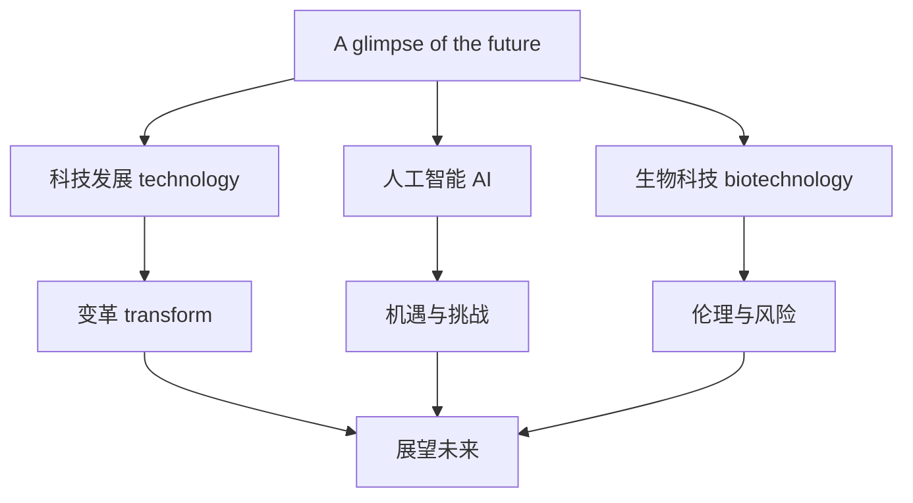

# 词汇与课文精读（Understanding ideas）

## 核心概念 / 课标要求
- 本课为外研版选择性必修第三册 Unit 4 A glimpse of the future 的 Understanding ideas 部分，主题为"展望未来"。
- 课标要求：理解课文主旨，掌握与科技、未来、发展相关的核心词汇，把握说明文与议论的结构。
- 主题：探讨科技发展对未来的影响，展望人工智能、生物科技等领域的变革。

## 知识梳理

| 类别 | 核心词汇 | 用法 |
|------|---------|------|
| 科技 | technology, innovation, artificial | artificial intelligence 人工智能 |
| 未来 | future, prospect, prediction | prospect 指前景 |
| 发展 | develop, advance, breakthrough | breakthrough 指突破 |
| 影响 | impact, transform, revolution | transform 指变革 |

## 重点探究
1. **课文主旨**：课文通过介绍人工智能、生物科技等前沿领域的发展，展望科技对未来的影响，探讨机遇与挑战并存。
2. **核心词汇辨析**：technology（技术）与 technique（技巧）不同；innovation（创新）与 invention（发明）不同；impact（影响）与 effect（效果）不同。
3. **说明议论结构**：课文采用"引入话题—介绍发展—分析影响—展望未来"的结构，通过具体事例说明科技变革。

## 易错点
- technology 指技术，technique 指技巧，勿混淆。
- artificial intelligence 是"人工智能"，勿缩写误用。
- innovation 是"创新"，invention 是"发明"，勿混淆。
- impact 是"影响"，常与 on 连用。

## 背记要点
1. technology 技术，innovation 创新，breakthrough 突破。
2. artificial intelligence 人工智能。
3. prospect 前景，prediction 预测。
4. transform 变革，revolution 革命。
5. 课文展望科技未来，探讨机遇与挑战。
6. impact on 对……的影响。

## 自测题
1. 用英语解释 technology 与 technique 的区别。
2. 课文的主旨是什么？
3. 列举三个与科技相关的核心词汇。
4. 说明议论的结构是怎样的？
5. 用 impact on 造句。

## 相关知识点
- 关联 Unit 4 语法（Using language）与读写（Developing ideas）。
- 主题与"科技发展""未来展望"话题相关。
- 为高考英语科技类阅读奠定基础。
