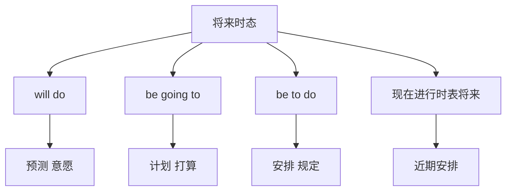

# 语法与语言运用（Using language）

## 核心概念 / 课标要求
- 本课为外研版选择性必修第三册 Unit 4 A glimpse of the future 的 Using language 部分，主题为"展望未来"。
- 课标要求：掌握本单元核心语法——将来时态（Future Tenses）的多种表达，并能运用于表达。
- 语法重点：will, be going to, be to do, 现在进行时表将来等。

## 知识梳理

| 表达方式 | 用法 | 例句 |
|---------|------|------|
| will do | 表示预测、意愿 | Technology will change... |
| be going to | 表示计划、打算 | We are going to... |
| be to do | 表示安排、规定 | The plan is to... |
| 现在进行时 | 表示近期安排 | The project is starting... |

## 重点探究
1. **will 与 be going to**：will 表示预测、临时决定或意愿；be going to 表示事先计划或打算，如"Technology will change our lives"与"We are going to develop AI"。
2. **be to do 与现在进行时表将来**：be to do 表示安排、规定，如"The plan is to build a smart city"；现在进行时表将来表示近期安排，如"The project is starting next month"。
3. **时态选择**：根据语境选择恰当的将来时表达，预测用 will，计划用 be going to，安排用 be to do 或现在进行时。

## 易错点
- will 表示预测、临时决定，be going to 表示计划、打算。
- be to do 表示安排、规定，勿与 be going to 混淆。
- 现在进行时表将来只用于近期安排。
- 时间状语从句中常用一般现在时表将来。

## 背记要点
1. will do 表示预测、意愿。
2. be going to 表示计划、打算。
3. be to do 表示安排、规定。
4. 现在进行时表将来表示近期安排。
5. 时间状语从句用一般现在时表将来。
6. 根据语境选择将来时表达。

## 自测题
1. will 与 be going to 有何区别？
2. 用 be to do 造一个句子。
3. 现在进行时如何表将来？
4. 用 will 造一个预测未来的句子。
5. 改正：I will going to study AI.

## 相关知识点
- 关联 Unit 4 词汇（Understanding ideas）与读写（Developing ideas）。
- 将来时态是高考英语语法重点。
- 与一般现在时、现在进行时共同构成时态体系。
