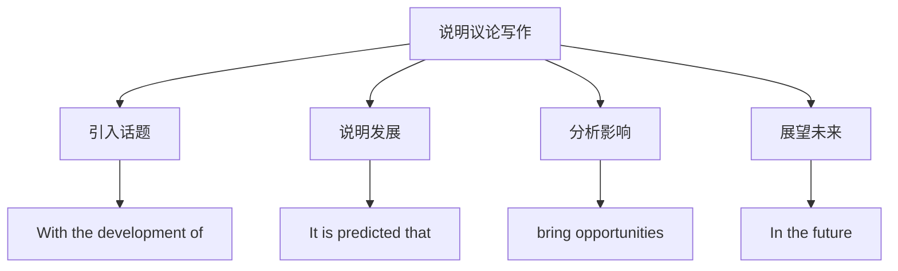

# 读写与表达（Developing ideas）

## 核心概念 / 课标要求
- 本课为外研版选择性必修第三册 Unit 4 A glimpse of the future 的 Developing ideas 部分，主题为"展望未来"。
- 课标要求：通过读写训练，提升说明议论写作与观点表达能力，学会围绕"科技与未来"展开论述。
- 写作重点：说明议论的结构，以及表达预测与展望的高级句式。

## 知识梳理

| 写作要素 | 内容 | 表达句式 |
|---------|------|---------|
| 引入 | 介绍科技话题 | With the development of... |
| 发展 | 说明科技进展 | It is predicted that... |
| 影响 | 分析机遇与挑战 | This will bring... |
| 展望 | 展望未来 | In the future, ... |

## 重点探究
1. **说明议论结构**：说明议论通常包括引入（介绍话题）、发展（说明进展）、影响（分析机遇与挑战）、展望（展望未来）四部分，通过具体事例说明科技变革。
2. **高级句式**：运用"With the development of""It is predicted that"等句式提升表达，如"It is predicted that AI will transform our lives"。
3. **观点表达**：学会用 This will bring opportunities and challenges, In the future 等句式表达预测与展望，使论述更有说服力。

## 易错点
- 说明议论要有具体事例，勿空泛。
- It is predicted that 后接从句，勿误用。
- With the development of 后接名词或动名词。
- 展望要合理，勿过于夸张。

## 背记要点
1. 说明议论结构：引入—发展—影响—展望。
2. With the development of 随着……的发展。
3. It is predicted that 据预测。
4. bring opportunities and challenges 带来机遇与挑战。
5. In the future 在未来。
6. 用具体事例说明科技变革。

## 自测题
1. 说明议论的基本结构是什么？
2. 用 It is predicted that 写一个句子。
3. 用 With the development of 造句。
4. 围绕"科技与未来"写一个展望段。
5. 如何使说明议论更有说服力？

## 相关知识点
- 关联 Unit 4 词汇与语法（Understanding ideas / Using language）。
- 说明议论写作是高考英语写作重点。
- 与"科技发展""未来展望"话题相关。
