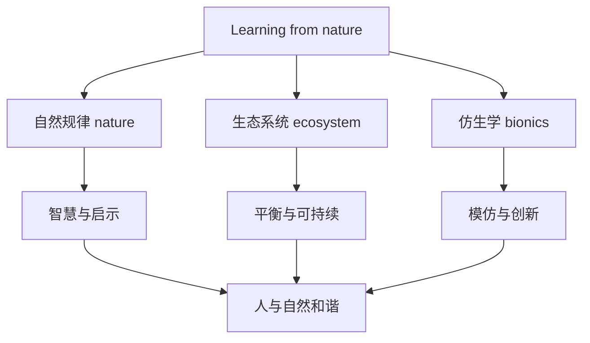

# 词汇与课文精读（Understanding ideas）

## 核心概念 / 课标要求
- 本课为外研版选择性必修第三册 Unit 5 Learning from nature 的 Understanding ideas 部分，主题为"向自然学习"。
- 课标要求：理解课文主旨，掌握与自然、生态、仿生相关的核心词汇，把握说明文与议论的结构。
- 主题：探讨人类如何从自然中汲取智慧，学习自然的规律与启示。

## 知识梳理

| 类别 | 核心词汇 | 用法 |
|------|---------|------|
| 自然 | nature, ecosystem, habitat | ecosystem 指生态系统 |
| 生态 | ecology, sustainable, balance | sustainable 指可持续的 |
| 仿生 | bionics, mimic, inspiration | mimic 指模仿 |
| 启示 | lesson, wisdom, harmony | harmony 指和谐 |

## 重点探究
1. **课文主旨**：课文通过介绍人类从自然中汲取智慧的事例（如仿生学、生态平衡），探讨向自然学习的意义，倡导人与自然和谐相处。
2. **核心词汇辨析**：nature（自然）与 environment（环境）不同；sustainable（可持续的）与 renewable（可再生的）不同；mimic（模仿）与 imitate（模仿）近义。
3. **说明议论结构**：课文采用"引入话题—介绍事例—分析启示—总结意义"的结构，通过具体事例说明向自然学习的价值。

## 易错点
- nature 指自然，environment 指环境，勿混淆。
- sustainable 是"可持续的"，renewable 是"可再生的"。
- ecosystem 是"生态系统"，勿误用。
- harmony 是"和谐"，常与 with 连用。

## 背记要点
1. nature 自然，ecosystem 生态系统，habitat 栖息地。
2. sustainable 可持续的，balance 平衡。
3. bionics 仿生学，mimic 模仿，inspiration 灵感。
4. 课文倡导向自然学习，人与自然和谐。
5. 说明议论结构：引入—事例—启示—意义。
6. harmony with 与……和谐。

## 自测题
1. 用英语解释 nature 与 environment 的区别。
2. 课文的主旨是什么？
3. 列举三个与生态相关的核心词汇。
4. 说明议论的结构是怎样的？
5. 用 sustainable 造句。

## 相关知识点
- 关联 Unit 5 语法（Using language）与读写（Developing ideas）。
- 主题与"生态环保""人与自然"话题相关。
- 为高考英语生态类阅读奠定基础。
