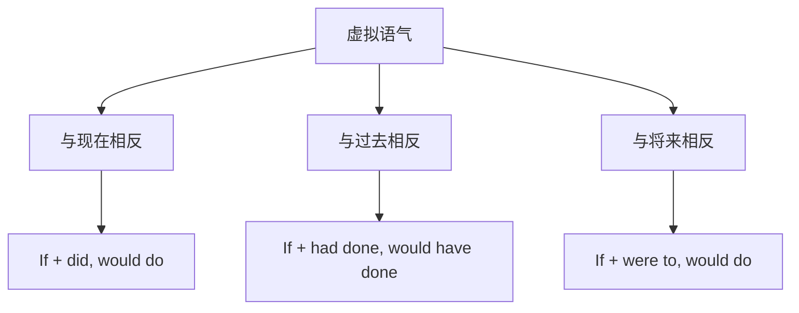

# 语法与语言运用（Using language）

## 核心概念 / 课标要求
- 本课为外研版选择性必修第三册 Unit 5 Learning from nature 的 Using language 部分，主题为"向自然学习"。
- 课标要求：掌握本单元核心语法——虚拟语气（Subjunctive Mood）的用法，并能运用于表达。
- 语法重点：与现在、过去、将来事实相反的虚拟条件句。

## 知识梳理

| 时间 | 条件从句 | 主句 | 例句 |
|------|---------|------|------|
| 现在 | If + did/were | would/could do | If I were a bird... |
| 过去 | If + had done | would have done | If we had protected... |
| 将来 | If + were to/should | would do | If it should rain... |

## 重点探究
1. **与现在事实相反**：条件从句用过去式（be 用 were），主句用 would/could/might + 动词原形，如"If I were a bird, I would fly freely"。
2. **与过去事实相反**：条件从句用 had done，主句用 would have done，如"If we had protected the forest, the ecosystem would have survived"。
3. **与将来事实相反**：条件从句用 were to do 或 should do，主句用 would do，如"If it should rain, the plants would grow"。

## 易错点
- 与现在相反时 be 用 were，勿用 was。
- 与过去相反时主句用 would have done。
- 虚拟条件句与真实条件句不同，勿混淆。
- 主句与从句的时态要对应。

## 背记要点
1. 与现在相反：If + did, would do。
2. 与过去相反：If + had done, would have done。
3. 与将来相反：If + were to, would do。
4. 与现在相反时 be 用 were。
5. 虚拟语气表示与事实相反的假设。
6. 主句与从句时态要对应。

## 自测题
1. 用虚拟语气写一个与现在相反的句子。
2. 与过去相反的虚拟条件句结构是什么？
3. 与将来相反的虚拟条件句结构是什么？
4. 为什么与现在相反时 be 用 were？
5. 改正：If I was a bird, I would fly.

## 相关知识点
- 关联 Unit 5 词汇（Understanding ideas）与读写（Developing ideas）。
- 虚拟语气是高考英语语法重点。
- 与条件状语从句、时态共同构成语法体系。
