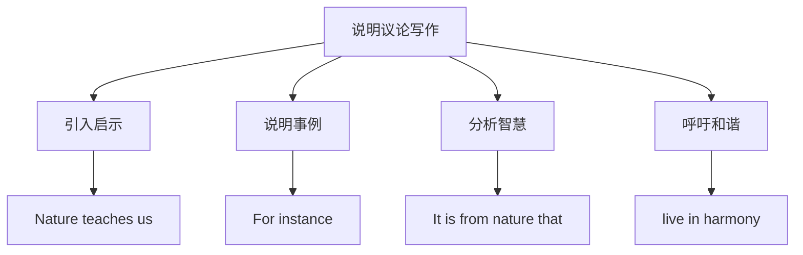

# 读写与表达（Developing ideas）

## 核心概念 / 课标要求
- 本课为外研版选择性必修第三册 Unit 5 Learning from nature 的 Developing ideas 部分，主题为"向自然学习"。
- 课标要求：通过读写训练，提升说明议论写作与观点表达能力，学会围绕"向自然学习"展开论述。
- 写作重点：说明议论的结构，以及表达启示与呼吁的高级句式。

## 知识梳理

| 写作要素 | 内容 | 表达句式 |
|---------|------|---------|
| 引入 | 介绍自然启示 | Nature teaches us... |
| 事例 | 说明具体事例 | For instance, ... |
| 启示 | 分析自然智慧 | It is from nature that... |
| 呼吁 | 倡导和谐共生 | We should live in harmony... |

## 重点探究
1. **说明议论结构**：说明议论通常包括引入（介绍自然启示）、事例（说明具体事例）、启示（分析自然智慧）、呼吁（倡导和谐共生）四部分，通过具体事例说明向自然学习的价值。
2. **高级句式**：运用强调句"It is from nature that ..."、虚拟语气等提升表达，如"It is from nature that we learn sustainability"。
3. **观点表达**：学会用 Nature teaches us, We should live in harmony with nature 等句式表达启示与呼吁，使论述更有说服力。

## 易错点
- 说明议论要有具体事例，勿空泛。
- 强调句 It is ... that ... 中 that 不可省略。
- live in harmony with 与……和谐相处。
- 呼吁要合理，勿过于绝对。

## 背记要点
1. 说明议论结构：引入—事例—启示—呼吁。
2. Nature teaches us 自然教会我们。
3. For instance 例如。
4. 强调句 It is from nature that ... 突出启示。
5. live in harmony with 与……和谐相处。
6. 用具体事例说明向自然学习的价值。

## 自测题
1. 说明议论的基本结构是什么？
2. 用强调句写一个关于自然启示的句子。
3. 用 live in harmony with 造句。
4. 围绕"向自然学习"写一个呼吁段。
5. 如何使说明议论更有说服力？

## 相关知识点
- 关联 Unit 5 词汇与语法（Understanding ideas / Using language）。
- 说明议论写作是高考英语写作重点。
- 与"生态环保""人与自然"话题相关。
