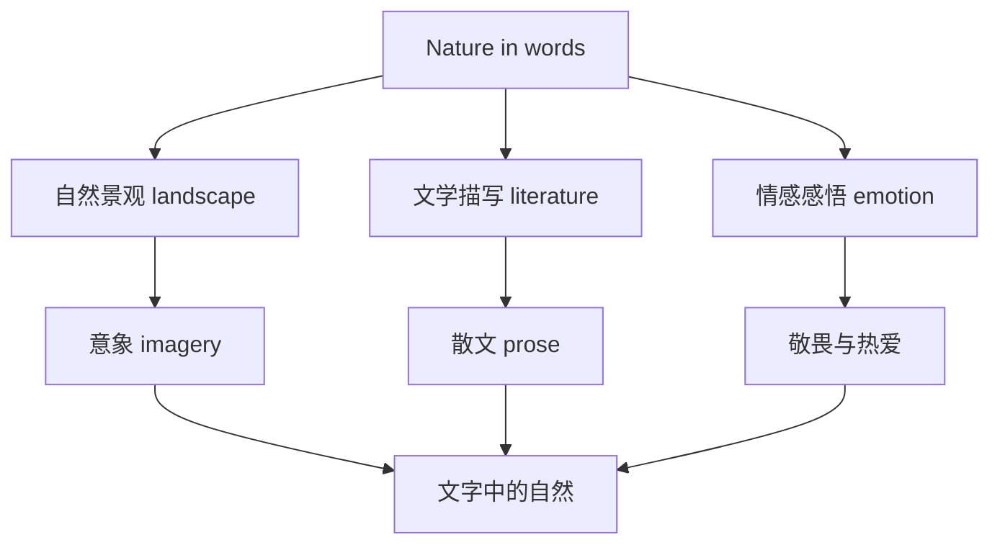

# 词汇与课文精读（Understanding ideas）

## 核心概念 / 课标要求
- 本课为外研版选择性必修第三册 Unit 6 Nature in words 的 Understanding ideas 部分，主题为"文字中的自然"。
- 课标要求：理解课文主旨，掌握与自然、文学、描写相关的核心词汇，把握文学性文本的赏析方法。
- 主题：探讨作家如何用文字描绘自然，表达对自然的感悟与热爱。

## 知识梳理

| 类别 | 核心词汇 | 用法 |
|------|---------|------|
| 自然 | landscape, scenery, wilderness | landscape 指风景 |
| 文学 | literature, prose, imagery | imagery 指意象 |
| 描写 | describe, depict, portray | depict 指描绘 |
| 感悟 | appreciation, awe, reverence | awe 指敬畏 |

## 重点探究
1. **课文主旨**：课文通过赏析作家描绘自然的文字，探讨如何用语言表现自然之美，表达对自然的敬畏与热爱。
2. **核心词汇辨析**：landscape（风景）与 scenery（景色）近义；depict（描绘）与 describe（描述）不同，depict 更强调形象化；imagery（意象）是文学术语。
3. **文学赏析方法**：赏析文学性文本时，关注意象、修辞、语言风格，体会作者如何通过文字传达对自然的感悟。

## 易错点
- landscape 指风景，scenery 指景色，勿混淆。
- depict 强调形象化描绘，describe 指一般描述。
- imagery 是"意象"，是文学术语，勿误用。
- awe 是"敬畏"，reverence 是"崇敬"，勿混淆。

## 背记要点
1. landscape 风景，scenery 景色，wilderness 荒野。
2. literature 文学，prose 散文，imagery 意象。
3. depict 描绘，portray 刻画，describe 描述。
4. 课文探讨文字中的自然，表达敬畏与热爱。
5. 赏析方法：意象、修辞、语言风格。
6. appreciation 欣赏，awe 敬畏。

## 自测题
1. 用英语解释 landscape 与 scenery 的区别。
2. 课文的主旨是什么？
3. 列举三个与文学描写相关的核心词汇。
4. 如何赏析文学性文本？
5. 用 depict 造句。

## 相关知识点
- 关联 Unit 6 语法（Using language）与读写（Developing ideas）。
- 主题与"自然文学""生态审美"话题相关。
- 为高考英语文学类阅读奠定基础。
