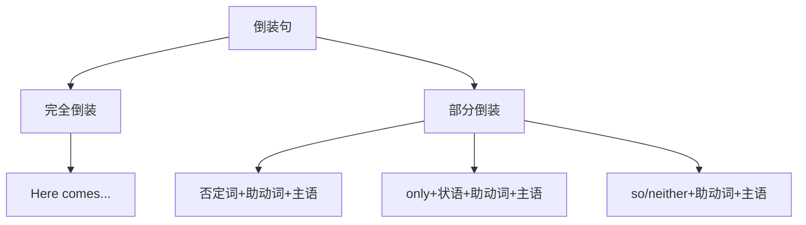

# 语法与语言运用（Using language）

## 核心概念 / 课标要求
- 本课为外研版选择性必修第三册 Unit 6 Nature in words 的 Using language 部分，主题为"文字中的自然"。
- 课标要求：掌握本单元核心语法——倒装句（Inversion）的用法，并能运用于表达。
- 语法重点：完全倒装与部分倒装，以及否定词、only 等引起的倒装。

## 知识梳理

| 类型 | 用法 | 例句 |
|------|------|------|
| 完全倒装 | 地点副词/介词短语置于句首 | Here comes the river |
| 部分倒装 | 否定词置于句首 | Never have I seen... |
| only 倒装 | only + 状语置于句首 | Only then did I realize... |
| so/neither 倒装 | 表示"也/也不" | So do I. |

## 重点探究
1. **完全倒装**：当 here, there, 地点副词或介词短语置于句首时，主语与谓语完全倒装，如"Here comes the river"。
2. **部分倒装**：否定词（never, hardly, not only）或 only + 状语置于句首时，用"助动词/情态动词 + 主语 + 谓语"的部分倒装，如"Never have I seen such beauty"。
3. **so/neither 倒装**：表示"也……"用 so + 助动词 + 主语，表示"也不……"用 neither/nor + 助动词 + 主语，如"So do I"。

## 易错点
- 完全倒装用于地点副词置于句首，部分倒装用于否定词置于句首。
- only + 状语置于句首才倒装，only + 主语不倒装。
- so 倒装表示"也"，neither 倒装表示"也不"。
- 倒装时助动词要与主语一致。

## 背记要点
1. 完全倒装：Here comes the river。
2. 部分倒装：Never have I seen...
3. only + 状语置于句首倒装。
4. so 表示"也"，neither 表示"也不"。
5. 否定词置于句首引起部分倒装。
6. 倒装时助动词与主语一致。

## 自测题
1. 用完全倒装造一个句子。
2. 用 Never 开头的部分倒装造句。
3. only + 状语置于句首如何倒装？
4. so 与 neither 倒装有何区别？
5. 改正：Only then I realized the beauty.

## 相关知识点
- 关联 Unit 6 词汇（Understanding ideas）与读写（Developing ideas）。
- 倒装句是高考英语语法重点。
- 与强调句、虚拟语气共同构成语法体系。
