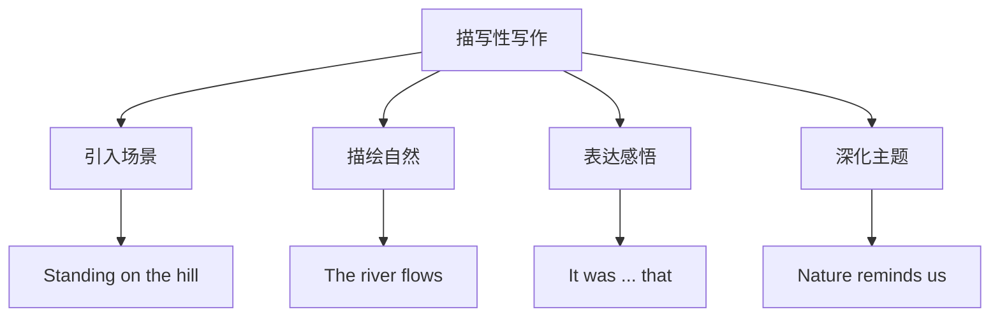

# 读写与表达（Developing ideas）

## 核心概念 / 课标要求
- 本课为外研版选择性必修第三册 Unit 6 Nature in words 的 Developing ideas 部分，主题为"文字中的自然"。
- 课标要求：通过读写训练，提升文学性写作与观点表达能力，学会用文字描绘自然、表达感悟。
- 写作重点：描写性写作的结构，以及表达自然感悟的高级句式。

## 知识梳理

| 写作要素 | 内容 | 表达句式 |
|---------|------|---------|
| 引入 | 引入自然场景 | Standing on the hill, ... |
| 描写 | 描绘自然之美 | The river flows... |
| 感悟 | 表达内心感受 | It was ... that ... |
| 升华 | 深化主题 | Nature reminds us... |

## 重点探究
1. **描写性写作结构**：描写性写作通常包括引入（引入自然场景）、描写（描绘自然之美）、感悟（表达内心感受）、升华（深化主题）四部分，通过意象与修辞表现自然。
2. **高级句式**：运用倒装句、强调句、非谓语动词等提升表达，如"Only then did I realize the beauty of nature"。
3. **观点表达**：学会用 Standing on the hill, Nature reminds us 等句式表达自然感悟，使描写更有感染力。

## 易错点
- 描写性写作要有具体意象，勿空泛。
- 倒装句 Only then did I realize 中助动词前置。
- 强调句 It was ... that ... 中 that 不可省略。
- 感悟要自然，勿生硬。

## 背记要点
1. 描写性写作结构：引入—描写—感悟—升华。
2. Standing on the hill 站在山丘上。
3. 倒装句 Only then did I realize 突出感悟。
4. 强调句 It was ... that ... 突出意象。
5. Nature reminds us 自然提醒我们。
6. 用意象与修辞表现自然之美。

## 自测题
1. 描写性写作的基本结构是什么？
2. 用倒装句写一个关于自然的句子。
3. 用强调句突出"自然之美"。
4. 围绕"文字中的自然"写一个描写段。
5. 如何使描写更有感染力？

## 相关知识点
- 关联 Unit 6 词汇与语法（Understanding ideas / Using language）。
- 描写性写作是高考英语写作重点。
- 与"自然文学""生态审美"话题相关。
