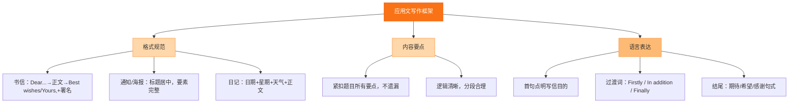

# 专题十三 书面表达（应用文）

## 核心概念 / 考点

应用文写作包括书信、电子邮件、通知、日记、演讲稿、倡议书等，考查考生根据题目要求进行实际交际的能力。评分标准包括内容要点完整、语言准确、结构清晰、格式正确。常见书信类型有建议信、邀请信、申请信、感谢信、道歉信等。

**解题方法**：先审题明确文体、对象和要点，再列提纲组织内容。应用文一般分三段：开头（表明目的）、正文（展开要点）、结尾（表达期望）。注意格式（称呼、落款）和语气（正式/非正式）。

## 知识梳理

| 文体 | 开头常用语 | 结尾常用语 | 注意事项 |
| --- | --- | --- | --- |
| 建议信 | I'm writing to give you some advice | I hope my advice is helpful | 语气委婉 |
| 邀请信 | I'm writing to invite you to... | I'm looking forward to your reply | 说明时间地点 |
| 申请信 | I'm writing to apply for... | I would appreciate your consideration | 突出优势 |
| 感谢信 | I'm writing to express my thanks | Thanks again for your help | 表达真诚 |
| 道歉信 | I'm writing to apologize for... | I hope you can forgive me | 说明原因 |

## 结构示意

<svg viewBox="0 0 360 240" xmlns="http://www.w3.org/2000/svg" style="max-width:100%">
  <rect x="120" y="15" width="120" height="34" rx="8" fill="#2563eb" stroke="#1d4ed8" stroke-width="2"/>
  <text x="180" y="36" font-size="13" fill="#fff" text-anchor="middle">应用文写作结构</text>
  <line x1="180" y1="49" x2="180" y2="70" stroke="#64748b" stroke-width="2"/>
  <rect x="70" y="70" width="220" height="30" rx="8" fill="#e0f2fe" stroke="#0ea5e9" stroke-width="2"/>
  <text x="180" y="89" font-size="12" fill="#0c4a6e" text-anchor="middle">开头：表明写作目的</text>
  <line x1="180" y1="100" x2="180" y2="118" stroke="#64748b" stroke-width="2"/>
  <rect x="70" y="118" width="220" height="30" rx="8" fill="#dcfce7" stroke="#16a34a" stroke-width="2"/>
  <text x="180" y="137" font-size="12" fill="#14532d" text-anchor="middle">正文：展开要点，条理清晰</text>
  <line x1="180" y1="148" x2="180" y2="166" stroke="#64748b" stroke-width="2"/>
  <rect x="70" y="166" width="220" height="30" rx="8" fill="#fef3c7" stroke="#d97706" stroke-width="2"/>
  <text x="180" y="185" font-size="12" fill="#78350f" text-anchor="middle">结尾：表达期望，礼貌收尾</text>
  <line x1="180" y1="196" x2="180" y2="214" stroke="#64748b" stroke-width="2"/>
  <rect x="70" y="214" width="220" height="26" rx="8" fill="#fce7f3" stroke="#db2777" stroke-width="2"/>
  <text x="180" y="231" font-size="12" fill="#831843" text-anchor="middle">格式：称呼、落款、语气得体</text>
</svg>

## 结构图示

## 典型例题

**例 1**：假设你是李华，给外教写一封建议信，建议他如何提高中文水平。

**解**：开头 "I'm writing to give you some advice on how to improve your Chinese."；正文分点建议（多听多说、看中文电影、交中国朋友）；结尾 "I hope my advice is helpful."。

**例 2**：假设你是李华，邀请外教参加学校举办的英语晚会。

**解**：开头 "I'm writing to invite you to our school's English evening."；正文说明时间、地点、活动内容；结尾 "I'm looking forward to your reply."。

**例 3**：假设你是李华，给朋友写一封感谢信，感谢他帮助自己学习英语。

**解**：开头 "I'm writing to express my sincere thanks for your help."；正文回忆帮助细节；结尾 "Thanks again for your kindness."。

## 易错点

- 审题不清，遗漏内容要点。
- 格式错误，缺称呼或落款。
- 语气不当，过于生硬或过于随意。
- 语言错误多，时态、主谓不一致。
- 结构混乱，要点堆砌无条理。

## 背记要点

1. 先审题明确文体、对象、要点。
2. 应用文分三段：目的、要点、期望。
3. 常用开头：I'm writing to...（表明目的）。
4. 常用结尾：I'm looking forward to your reply.
5. 注意格式：称呼顶格、落款署名。
6. 语气得体：建议委婉、邀请热情、感谢真诚。

## 自测题

1. 写一封邀请信的开头句。
2. 写一封建议信的结尾句。
3. 写一封申请信的开头句。
4. 判断：应用文写作可以忽略格式。（　）
5. 写一封感谢信的常用表达。

## 相关知识点

与 [[专题十四 书面表达（读后续写）]] 的写作能力相关；与 [[专题十五 词汇与语法基础]] 的语言积累相关。
