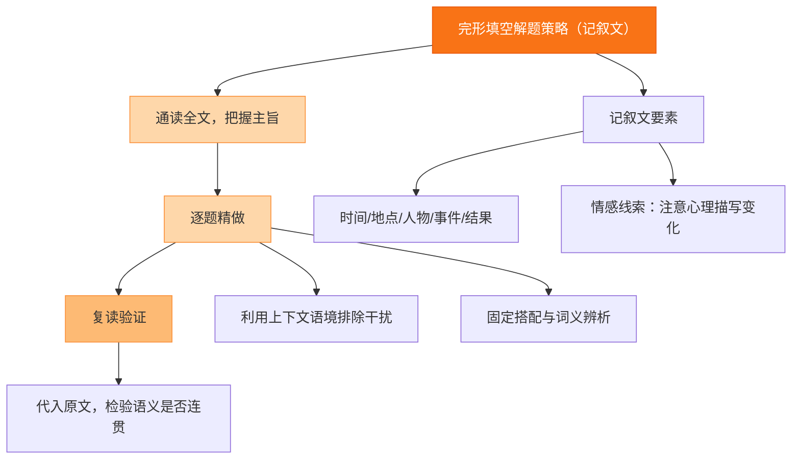

# 专题二 完形填空（记叙文）

## 核心概念 / 考点

完形填空记叙文以讲述一个故事为主，通常按时间顺序展开，包含人物、事件、情节发展和情感变化。考查考生在语境中综合运用词汇、语法、逻辑和语篇知识的能力，重点考查动词、名词、形容词、副词及短语辨析。

**解题方法**：先通读全文把握大意与情感主线，再逐空分析上下文逻辑；注意首句一般不设空，常点明背景；关注人物情感变化（如从沮丧到振作）、时间线索词（then, later, finally）和逻辑关系词（but, so, however）。

## 知识梳理

| 考查角度 | 常见词类 | 解题线索 | 示例 |
| --- | --- | --- | --- |
| 动词辨析 | 动作、状态 | 前后动作逻辑 | give up / keep on |
| 名词辨析 | 人物、事物 | 上下文复现 | courage / confidence |
| 形容词副词 | 情感、程度 | 情感主线 | disappointed / delighted |
| 短语搭配 | 固定搭配 | 语法搭配 | look forward to |
| 逻辑关系 | 转折、因果 | 连接词 | however / therefore |

## 结构示意

<svg viewBox="0 0 360 240" xmlns="http://www.w3.org/2000/svg" style="max-width:100%">
  <rect x="120" y="15" width="120" height="34" rx="8" fill="#2563eb" stroke="#1d4ed8" stroke-width="2"/>
  <text x="180" y="36" font-size="13" fill="#fff" text-anchor="middle">记叙文完形流程</text>
  <line x1="180" y1="49" x2="180" y2="70" stroke="#64748b" stroke-width="2"/>
  <rect x="70" y="70" width="220" height="30" rx="8" fill="#e0f2fe" stroke="#0ea5e9" stroke-width="2"/>
  <text x="180" y="89" font-size="12" fill="#0c4a6e" text-anchor="middle">通读全文，把握故事与情感主线</text>
  <line x1="180" y1="100" x2="180" y2="118" stroke="#64748b" stroke-width="2"/>
  <rect x="70" y="118" width="220" height="30" rx="8" fill="#dcfce7" stroke="#16a34a" stroke-width="2"/>
  <text x="180" y="137" font-size="12" fill="#14532d" text-anchor="middle">逐空分析上下文逻辑与情感</text>
  <line x1="180" y1="148" x2="180" y2="166" stroke="#64748b" stroke-width="2"/>
  <rect x="70" y="166" width="220" height="30" rx="8" fill="#fef3c7" stroke="#d97706" stroke-width="2"/>
  <text x="180" y="185" font-size="12" fill="#78350f" text-anchor="middle">代入验证，确保语篇连贯</text>
  <line x1="180" y1="196" x2="180" y2="214" stroke="#64748b" stroke-width="2"/>
  <rect x="70" y="214" width="220" height="26" rx="8" fill="#fce7f3" stroke="#db2777" stroke-width="2"/>
  <text x="180" y="231" font-size="12" fill="#831843" text-anchor="middle">复读全文，检查逻辑与情感一致</text>
</svg>

## 结构图示

## 典型例题

**例 1**：He was very ___ when he failed the exam, but his teacher encouraged him to try again. A. delighted B. disappointed C. excited D. proud

**解**：由 "failed the exam" 可知他应感到失望，故选 B. disappointed。注意 but 后情感转折。

**例 2**：She ___ to help the old man cross the street, though she was in a hurry. A. refused B. stopped C. offered D. forgot

**解**：由 "though she was in a hurry" 可知她仍主动帮忙，故选 C. offered（主动提出）。

**例 3**：After years of hard work, his dream finally came ___. A. true B. real C. right D. sure

**解**：固定搭配 come true（实现），故选 A. true。

## 易错点

- 只凭单词意思选词，忽略上下文逻辑与情感线索。
- 忽视首句背景信息，导致整体理解偏差。
- 混淆形近词或近义词（如 raise/rise, lie/lay）。
- 忽视转折、因果等逻辑关系词。
- 选词后未代入全文验证，导致前后矛盾。

## 背记要点

1. 首句不设空，常点明人物、时间、地点与背景。
2. 关注情感变化词：disappointed, encouraged, grateful, proud。
3. 时间线索词：first, then, later, finally, at last。
4. 逻辑关系词：but, however, so, because, although。
5. 常见固定搭配：come true, give up, look forward to, make up one's mind。
6. 动词题注意动作发生的先后顺序。

## 自测题

1. He was so ___ that he couldn't say a word. A. nervous B. happy C. calm D. brave
2. She ___ her hand to answer the question. A. raised B. rose C. lifted D. put
3. The boy ___ to be a doctor when he grows up. A. hopes B. hopes for C. wishes D. expects
4. Though it was raining, they ___ on with the work. A. went B. carried C. kept D. moved
5. His hard work was finally ___ with success. A. rewarded B. paid C. given D. returned

## 相关知识点

与 [[专题三 完形填空（说明文/夹叙夹议）]] 的解题方法相通；与 [[专题十五 词汇与语法基础]] 中的动词短语辨析相关。
