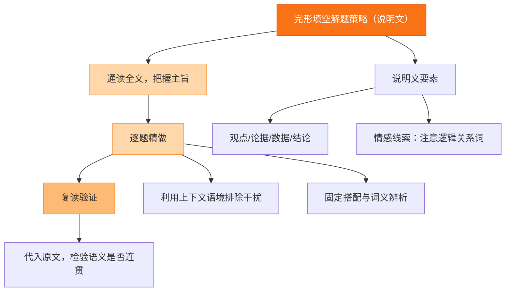

# 专题三 完形填空（说明文/夹叙夹议）

## 核心概念 / 考点

说明文完形以介绍事物、现象或道理为主，结构清晰、逻辑严密；夹叙夹议则先叙述事例再发表议论，最后点明主旨。考查考生把握说明对象、理解逻辑关系（因果、对比、举例、递进）以及辨析词汇的能力。

**解题方法**：说明文要抓住说明对象与说明顺序（时间、空间、逻辑）；夹叙夹议要分清"叙"与"议"两部分，议论部分常揭示文章主旨。注意段落首句常为段落主题句，逻辑连接词（for example, in addition, on the other hand）是重要线索。

## 知识梳理

| 文体 | 结构特点 | 解题重点 | 常见连接词 |
| --- | --- | --- | --- |
| 说明文 | 总分总、逻辑清晰 | 抓说明对象与顺序 | for example, in addition |
| 夹叙夹议 | 先叙后议 | 分清叙议、抓主旨 | however, therefore |
| 议论文 | 论点论据 | 抓论点与论据 | in my opinion, as a result |
| 科普类 | 现象-原因-结论 | 抓因果逻辑 | because, so, thus |

## 结构示意

<svg viewBox="0 0 360 240" xmlns="http://www.w3.org/2000/svg" style="max-width:100%">
  <rect x="120" y="15" width="120" height="34" rx="8" fill="#2563eb" stroke="#1d4ed8" stroke-width="2"/>
  <text x="180" y="36" font-size="13" fill="#fff" text-anchor="middle">说明/夹叙夹议完形</text>
  <line x1="180" y1="49" x2="60" y2="85" stroke="#64748b" stroke-width="2"/>
  <line x1="180" y1="49" x2="300" y2="85" stroke="#64748b" stroke-width="2"/>
  <rect x="20" y="85" width="120" height="40" rx="8" fill="#e0f2fe" stroke="#0ea5e9" stroke-width="2"/>
  <text x="80" y="102" font-size="12" fill="#0c4a6e" text-anchor="middle">说明文</text>
  <text x="80" y="118" font-size="11" fill="#0c4a6e" text-anchor="middle">抓对象与顺序</text>
  <rect x="220" y="85" width="120" height="40" rx="8" fill="#dcfce7" stroke="#16a34a" stroke-width="2"/>
  <text x="280" y="102" font-size="12" fill="#14532d" text-anchor="middle">夹叙夹议</text>
  <text x="280" y="118" font-size="11" fill="#14532d" text-anchor="middle">分清叙议抓主旨</text>
  <line x1="80" y1="125" x2="80" y2="160" stroke="#64748b" stroke-width="2"/>
  <line x1="280" y1="125" x2="280" y2="160" stroke="#64748b" stroke-width="2"/>
  <rect x="20" y="160" width="120" height="40" rx="8" fill="#fef3c7" stroke="#d97706" stroke-width="2"/>
  <text x="80" y="177" font-size="12" fill="#78350f" text-anchor="middle">逻辑连接词</text>
  <text x="80" y="193" font-size="11" fill="#78350f" text-anchor="middle">因果/对比/举例</text>
  <rect x="220" y="160" width="120" height="40" rx="8" fill="#fef3c7" stroke="#d97706" stroke-width="2"/>
  <text x="280" y="177" font-size="12" fill="#78350f" text-anchor="middle">段落主题句</text>
  <text x="280" y="193" font-size="11" fill="#78350f" text-anchor="middle">首句常点明主旨</text>
</svg>

## 结构图示

## 典型例题

**例 1**：Many people think exercise is tiring. ___, regular exercise actually gives us more energy. A. However B. Therefore C. Besides D. Instead

**解**：前后为转折关系（认为累 vs 实际更有精力），故选 A. However。

**例 2**：The Internet has changed our lives in many ways. ___, we can now shop and study online. A. For example B. In short C. As a result D. On the contrary

**解**：后句是前句的具体例子，故选 A. For example。

**例 3**：He failed many times, but he never gave up. ___, he finally succeeded. A. In the end B. At first C. In fact D. In general

**解**：由 "finally succeeded" 可知应选 A. In the end（最终）。

## 易错点

- 混淆说明文与夹叙夹议，抓错文章主旨。
- 忽视逻辑连接词，导致因果、转折关系判断错误。
- 只关注单句意思，忽略段落主题句。
- 对科普类文章的因果逻辑把握不准。
- 将举例、递进、对比等关系词混用。

## 背记要点

1. 说明文抓说明对象、说明顺序与段落主题句。
2. 夹叙夹议中议论部分常揭示文章主旨。
3. 因果词：because, so, therefore, as a result。
4. 转折词：however, but, on the contrary, instead。
5. 举例词：for example, for instance, such as。
6. 递进词：besides, in addition, moreover, what's more。

## 自测题

1. He is very busy. ___, he still finds time to help others. A. However B. Therefore C. Besides D. So
2. The weather was bad. ___, the match was put off. A. For example B. As a result C. In addition D. On the contrary
3. I like reading. ___, I often go to the library. A. In short B. In fact C. For instance D. In general
4. The plan sounds good. ___, it may cost too much. A. However B. Therefore C. Besides D. So
5. 判断：说明文通常采用"总分总"结构，首段常引出说明对象。（　）

## 相关知识点

与 [[专题二 完形填空（记叙文）]] 的解题方法相通；与 [[专题五 阅读理解（主旨大意）]] 的主旨把握能力相关。
