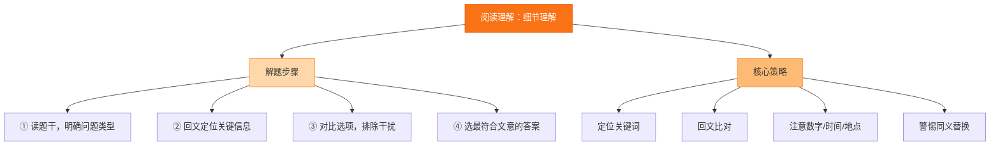

# 专题四 阅读理解（细节理解）

## 核心概念 / 考点

细节理解题考查考生对文中具体信息的查找与理解能力，是阅读理解中最常见的题型。设问常以 When, Where, Who, What, How, Why 等疑问词开头，答案一般能在原文中找到对应信息，但常以同义替换的形式出现。

**解题方法**：先读题干，确定关键词（专有名词、数字、时间、地点等），再回原文定位，找到对应句子后仔细比对。注意选项常对原文进行同义改写、词性转换或句式变换，切忌凭印象作答。

## 知识梳理

| 设问类型 | 常见问法 | 定位方法 | 注意事项 |
| --- | --- | --- | --- |
| 时间 | When did... | 找时间词 | 注意时态与先后 |
| 地点 | Where does... | 找地点词 | 注意场景转换 |
| 人物 | Who is... | 找人物名 | 注意指代关系 |
| 数字 | How many/much | 找数字 | 注意计算与单位 |
| 原因 | Why does... | 找 because, since | 注意因果对应 |

## 结构示意

<svg viewBox="0 0 360 240" xmlns="http://www.w3.org/2000/svg" style="max-width:100%">
  <rect x="120" y="15" width="120" height="34" rx="8" fill="#2563eb" stroke="#1d4ed8" stroke-width="2"/>
  <text x="180" y="36" font-size="13" fill="#fff" text-anchor="middle">细节理解四步法</text>
  <line x1="180" y1="49" x2="180" y2="70" stroke="#64748b" stroke-width="2"/>
  <rect x="70" y="70" width="220" height="30" rx="8" fill="#e0f2fe" stroke="#0ea5e9" stroke-width="2"/>
  <text x="180" y="89" font-size="12" fill="#0c4a6e" text-anchor="middle">1. 读题干，圈出关键词</text>
  <line x1="180" y1="100" x2="180" y2="118" stroke="#64748b" stroke-width="2"/>
  <rect x="70" y="118" width="220" height="30" rx="8" fill="#dcfce7" stroke="#16a34a" stroke-width="2"/>
  <text x="180" y="137" font-size="12" fill="#14532d" text-anchor="middle">2. 回原文定位对应句子</text>
  <line x1="180" y1="148" x2="180" y2="166" stroke="#64748b" stroke-width="2"/>
  <rect x="70" y="166" width="220" height="30" rx="8" fill="#fef3c7" stroke="#d97706" stroke-width="2"/>
  <text x="180" y="185" font-size="12" fill="#78350f" text-anchor="middle">3. 比对选项与原文（同义替换）</text>
  <line x1="180" y1="196" x2="180" y2="214" stroke="#64748b" stroke-width="2"/>
  <rect x="70" y="214" width="220" height="26" rx="8" fill="#fce7f3" stroke="#db2777" stroke-width="2"/>
  <text x="180" y="231" font-size="12" fill="#831843" text-anchor="middle">4. 排除干扰项，确定答案</text>
</svg>

## 结构图示

## 典型例题

**例 1**：原文 "The museum opens at 9 a.m. and closes at 5 p.m. every day except Monday." 问：When is the museum closed?

**解**：由 "except Monday" 可知博物馆周一闭馆，故选 "On Monday"。

**例 2**：原文 "Tom, a 15-year-old boy, won the first prize in the writing competition." 问：How old is Tom?

**解**：由 "a 15-year-old boy" 可知 Tom 15 岁，故选 "15"。

**例 3**：原文 "She was late for school because her bike broke down on the way." 问：Why was she late?

**解**：由 "because her bike broke down" 可知因自行车坏了而迟到，故选 "Her bike broke down"。

## 易错点

- 凭印象作答，未回原文定位。
- 忽视同义替换，只找原词。
- 被干扰项迷惑，如偷换主语、范围扩大或缩小。
- 数字题未注意单位换算或简单计算。
- 因果题混淆原因与结果。

## 背记要点

1. 先读题干圈关键词，再回原文定位。
2. 答案常为原文的同义替换，非原词照搬。
3. 注意排除干扰项：偷换概念、无中生有、以偏概全。
4. 数字题注意单位与计算。
5. 因果题找 because, since, as, so, therefore。
6. 细节题答案一般可在原文直接找到依据。

## 自测题

1. 原文 "The train leaves at 8:30 and arrives at 10:15." 问：How long does the journey take?
2. 原文 "Lucy, who is from Beijing, studies in Shanghai." 问：Where does Lucy come from?
3. 原文 "He didn't attend the meeting because he was ill." 问：Why didn't he attend the meeting?
4. 原文 "The book costs 20 dollars, but it's 15% off today." 问：What's the price today?
5. 判断：细节理解题答案一定能在原文中找到依据。（　）

## 相关知识点

与 [[专题一 听力理解]] 的细节定位方法相通；与 [[专题六 阅读理解（推理判断）]] 的定位能力相关。
