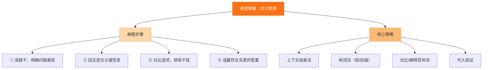

# 专题七 阅读理解（词义猜测）

## 核心概念 / 考点

词义猜测题考查考生根据上下文推断生词、短语或代词指代含义的能力。常见设问有 The underlined word "..." probably means ___ / The word "it" in Para.2 refers to ___。解题关键是利用上下文线索，而非死记单词。

**解题方法**：利用定义线索（is, means, that is）、举例线索（for example, such as）、对比线索（but, however, unlike）、因果线索（because, so）和同义复现线索来推断词义。代词指代题要回上文找最近的名词或名词短语。

## 知识梳理

| 线索类型 | 标志词 | 推断方法 | 示例 |
| --- | --- | --- | --- |
| 定义线索 | is, means, that is | 直接解释 | A zoo is a place... |
| 举例线索 | for example, such as | 归纳共性 | fruits such as apples |
| 对比线索 | but, however, unlike | 反义推断 | unlike his brother |
| 因果线索 | because, so, since | 逻辑推断 | so he felt exhausted |
| 同义复现 | 上下文重复 | 找同义词 | 前后呼应 |

## 结构示意

<svg viewBox="0 0 360 240" xmlns="http://www.w3.org/2000/svg" style="max-width:100%">
  <rect x="120" y="15" width="120" height="34" rx="8" fill="#2563eb" stroke="#1d4ed8" stroke-width="2"/>
  <text x="180" y="36" font-size="13" fill="#fff" text-anchor="middle">词义猜测线索</text>
  <line x1="180" y1="49" x2="60" y2="85" stroke="#64748b" stroke-width="2"/>
  <line x1="180" y1="49" x2="180" y2="85" stroke="#64748b" stroke-width="2"/>
  <line x1="180" y1="49" x2="300" y2="85" stroke="#64748b" stroke-width="2"/>
  <rect x="20" y="85" width="120" height="40" rx="8" fill="#e0f2fe" stroke="#0ea5e9" stroke-width="2"/>
  <text x="80" y="102" font-size="12" fill="#0c4a6e" text-anchor="middle">定义/举例</text>
  <text x="80" y="118" font-size="11" fill="#0c4a6e" text-anchor="middle">is, such as</text>
  <rect x="120" y="85" width="120" height="40" rx="8" fill="#dcfce7" stroke="#16a34a" stroke-width="2"/>
  <text x="180" y="102" font-size="12" fill="#14532d" text-anchor="middle">对比/因果</text>
  <text x="180" y="118" font-size="11" fill="#14532d" text-anchor="middle">but, because</text>
  <rect x="220" y="85" width="120" height="40" rx="8" fill="#fef3c7" stroke="#d97706" stroke-width="2"/>
  <text x="280" y="102" font-size="12" fill="#78350f" text-anchor="middle">同义复现</text>
  <text x="280" y="118" font-size="11" fill="#78350f" text-anchor="middle">上下文呼应</text>
  <line x1="80" y1="125" x2="80" y2="160" stroke="#64748b" stroke-width="2"/>
  <line x1="180" y1="125" x2="180" y2="160" stroke="#64748b" stroke-width="2"/>
  <line x1="280" y1="125" x2="280" y2="160" stroke="#64748b" stroke-width="2"/>
  <rect x="20" y="160" width="320" height="40" rx="8" fill="#fce7f3" stroke="#db2777" stroke-width="2"/>
  <text x="180" y="177" font-size="12" fill="#831843" text-anchor="middle">代词指代：回上文找最近名词</text>
  <text x="180" y="193" font-size="11" fill="#831843" text-anchor="middle">代入验证是否通顺</text>
</svg>

## 结构图示

## 典型例题

**例 1**：原文 "A zoo is a place where many kinds of animals are kept for people to see." 问：The underlined word "zoo" means ___.

**解**：由定义线索 "is a place where many kinds of animals are kept" 可知 zoo 意为"动物园"。

**例 2**：原文 "Unlike his brother, who is very outgoing, Tom is quite reserved." 问：The underlined word "reserved" probably means ___.

**解**：由对比线索 "unlike his brother" 可知 reserved 与 outgoing（外向）相反，意为"内向的"。

**例 3**：原文 "He was so exhausted after the long trip that he fell asleep immediately." 问：The underlined word "exhausted" means ___.

**解**：由因果线索 "so...that he fell asleep immediately" 可知 exhausted 意为"疲惫的"。

## 易错点

- 脱离上下文，只凭单词本义猜测。
- 忽视定义、举例、对比等线索词。
- 代词指代题未回上文找最近名词。
- 把词义猜测题当成词汇题死记硬背。
- 选出的词义代入原文后不通顺。

## 背记要点

1. 定义线索词：is, means, that is, refers to。
2. 举例线索词：for example, such as, like。
3. 对比线索词：but, however, unlike, while。
4. 因果线索词：because, so, since, therefore。
5. 代词指代题回上文找最近的名词或短语。
6. 选出的词义必须代入原文验证通顺。

## 自测题

1. 原文 "He is very frugal, always saving money and never wasting." 问：frugal 意为？
2. 原文 "The weather was terrible, so the picnic was cancelled." 问：terrible 意为？
3. 原文 "She is a diligent student who always studies hard." 问：diligent 意为？
4. 原文 "Tom bought a new car. It is very expensive." 问：It 指代什么？
5. 判断：词义猜测题可以完全脱离上下文作答。（　）

## 相关知识点

与 [[专题四 阅读理解（细节理解）]] 的定位能力相关；与 [[专题十五 词汇与语法基础]] 的词汇积累相关。
