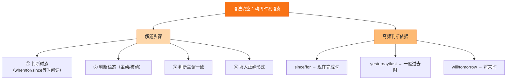

# 专题九 语法填空（动词时态语态）

## 核心概念 / 考点

语法填空考查考生在语境中正确运用动词时态和语态的能力。常见时态有一般现在时、一般过去时、一般将来时、现在完成时、过去完成时、进行时等；语态分主动语态和被动语态。解题关键是判断动作发生的时间与主被动关系。

**解题方法**：先判断句子主语与谓语动词的关系（主动/被动），再根据时间状语、上下文语境和固定句型确定时态。注意时间标志词：yesterday（过去时）、now（进行时）、since/for（完成时）、tomorrow（将来时）。

## 知识梳理

| 时态 | 标志词 | 结构 | 示例 |
| --- | --- | --- | --- |
| 一般现在时 | always, often | do/does | He works hard. |
| 一般过去时 | yesterday, ago | did | She went home. |
| 现在完成时 | since, for, already | have/has done | I have finished. |
| 过去完成时 | by then, before | had done | He had left. |
| 一般将来时 | tomorrow, next | will do | We will go. |
| 被动语态 | 主语承受动作 | be + done | The book was written. |

## 结构示意

<svg viewBox="0 0 360 240" xmlns="http://www.w3.org/2000/svg" style="max-width:100%">
  <rect x="120" y="15" width="120" height="34" rx="8" fill="#2563eb" stroke="#1d4ed8" stroke-width="2"/>
  <text x="180" y="36" font-size="13" fill="#fff" text-anchor="middle">时态语态判断</text>
  <line x1="180" y1="49" x2="180" y2="70" stroke="#64748b" stroke-width="2"/>
  <rect x="70" y="70" width="220" height="30" rx="8" fill="#e0f2fe" stroke="#0ea5e9" stroke-width="2"/>
  <text x="180" y="89" font-size="12" fill="#0c4a6e" text-anchor="middle">1. 判断主被动关系</text>
  <line x1="180" y1="100" x2="180" y2="118" stroke="#64748b" stroke-width="2"/>
  <rect x="70" y="118" width="220" height="30" rx="8" fill="#dcfce7" stroke="#16a34a" stroke-width="2"/>
  <text x="180" y="137" font-size="12" fill="#14532d" text-anchor="middle">2. 找时间标志词</text>
  <line x1="180" y1="148" x2="180" y2="166" stroke="#64748b" stroke-width="2"/>
  <rect x="70" y="166" width="220" height="30" rx="8" fill="#fef3c7" stroke="#d97706" stroke-width="2"/>
  <text x="180" y="185" font-size="12" fill="#78350f" text-anchor="middle">3. 结合上下文确定时态</text>
  <line x1="180" y1="196" x2="180" y2="214" stroke="#64748b" stroke-width="2"/>
  <rect x="70" y="214" width="220" height="26" rx="8" fill="#fce7f3" stroke="#db2777" stroke-width="2"/>
  <text x="180" y="231" font-size="12" fill="#831843" text-anchor="middle">4. 写出正确形式</text>
</svg>

## 结构图示

## 典型例题

**例 1**：He ___ (go) to Beijing yesterday.

**解**：由时间状语 yesterday 可知用一般过去时，填 went。

**例 2**：The book ___ (write) by a famous writer.

**解**：书是"被写"，主语承受动作，用被动语态，填 was written。

**例 3**：I ___ (live) here since 2010.

**解**：由 since 2010 可知用现在完成时，填 have lived。

## 易错点

- 忽视时间标志词，时态判断错误。
- 主被动关系判断错误，该用被动却用主动。
- 现在完成时与一般过去时混淆。
- 过去完成时与一般过去时混淆。
- 被动语态中 be 动词的时态变化遗漏。

## 背记要点

1. 时间标志词决定时态：yesterday, ago, since, for, now, tomorrow。
2. 主语承受动作用被动语态：be + done。
3. 现在完成时：have/has + done，标志词 since, for, already。
4. 过去完成时：had + done，表示"过去的过去"。
5. 一般将来时：will + do。
6. 被动语态中 be 动词随主语和时态变化。

## 自测题

1. She ___ (visit) her grandparents last weekend.
2. The classroom ___ (clean) by the students every day.
3. They ___ (finish) the work by the time we arrived.
4. I ___ (read) a book when he came in.
5. The letter ___ (send) to him tomorrow.

## 相关知识点

与 [[专题十 语法填空（非谓语动词）]] 的动词形式判断相关；与 [[专题十二 短文改错]] 的时态语态改错相通。
