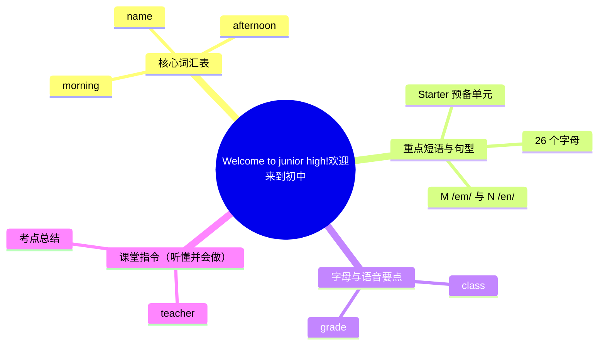

# Welcome to junior high!（欢迎来到初中）

标签：#Starter #问候与自我介绍 #字母与语音

## 一、单元定位

外研版七年级上册 **Starter 预备单元**，话题是"欢迎来到初中"。主要任务：会用英语打招呼、做自我介绍、听懂课堂指令、掌握 26 个字母和基础数字，为正式单元打好起点。

## 二、核心词汇表

| 单词 | 词性 | 音标 | 中文 | 搭配 / 例句 |
|---|---|---|---|---|
| hello / hi | int. | /həˈləʊ/ /haɪ/ | 你好 | Hello, I'm Li Ming. |
| morning | n. | /ˈmɔːnɪŋ/ | 早晨 | Good morning! |
| afternoon | n. | /ˌɑːftəˈnuːn/ | 下午 | Good afternoon, Ms Wang! |
| name | n. | /neɪm/ | 名字 | My name is Amy. |
| class | n. | /klɑːs/ | 班级；课 | I'm in Class 3. |
| grade | n. | /ɡreɪd/ | 年级 | Grade 7 七年级 |
| teacher | n. | /ˈtiːtʃə/ | 老师 | our English teacher |
| student | n. | /ˈstjuːdənt/ | 学生 | a new student 一名新生 |
| friend | n. | /frend/ | 朋友 | make friends 交朋友 |
| meet | v. | /miːt/ | 遇见 | Nice to meet you! |
| book | n. | /bʊk/ | 书 | open your books |
| pen | n. | /pen/ | 钢笔 | a red pen |
| number | n. | /ˈnʌmbə/ | 数字 | phone number 电话号码 |
| China | n. | /ˈtʃaɪnə/ | 中国 | I'm from China. |
| England | n. | /ˈɪŋɡlənd/ | 英格兰 | She's from England. |

## 三、重点短语与句型

| 英文 | 中文 |
|---|---|
| Good morning / afternoon / evening. | 早上/下午/晚上好。 |
| Nice to meet you. — Nice to meet you, too. | 见到你很高兴。——见到你我也很高兴。 |
| What's your name? — My name is... / I'm... | 你叫什么名字？——我叫…… |
| How are you? — I'm fine, thank you. And you? | 你好吗？——我很好，谢谢。你呢？ |
| Where are you from? — I'm from Beijing. | 你来自哪里？——我来自北京。 |
| This is my friend, Tony. | 这是我的朋友托尼。（介绍他人） |
| Welcome to our school! | 欢迎来到我们学校！ |
| See you later. / Goodbye. / Bye. | 回头见。/ 再见。 |

## 四、字母与语音要点

1. **26 个字母**要做到"听得出、读得准、写得对"，注意大小写占格：`b d f h k l t` 占上两格，`g j p q y` 占下两格。
2. 容易混淆的字母音：**G /dʒiː/ 与 J /dʒeɪ/**、**M /em/ 与 N /en/**、**B /biː/ 与 V /viː/**。
3. 五个元音字母：**A E I O U**，是后续学习开闭音节发音规则的基础。
4. 常见缩写认读：CD、TV、UK、USA、NBA、kg、cm。

## 五、课堂指令（听懂并会做）

Listen to me. 听我说 ｜ Open your books. 打开书 ｜ Close the door. 关门 ｜ Stand up. 起立 ｜ Sit down. 坐下 ｜ Put up your hand. 举手 ｜ Read after me. 跟我读 ｜ Work in pairs. 两人一组活动

## 结构图示

## 六、考点与易错点

- **Good morning** 用于中午 12 点前；下午用 **Good afternoon**；**Good night** 是"晚安（道别）"，不是见面问候。
- 回答 *Nice to meet you.* 要加 **too**：*Nice to meet you, too.*
- *How are you?* 问的是身体状况，不能答 *I'm Tony.*（那是回答 What's your name?）。
- 国家名、人名、句首字母必须**大写**：China, Tony, My name is...

## 七、小练习

1. 下午见到老师，应说：______（A. Good morning B. Good afternoon C. Good night）
2. — Nice to meet you! — ______（A. Thank you B. Nice to meet you, too C. I'm fine）
3. — ______ are you from? — I'm from Shanghai.（A. What B. How C. Where）
4. 写出下列字母的左右邻居：__ G __；__ P __
5. 汉译英：我叫王芳，我在七年级三班。

**答案**：1. B 2. B 3. C 4. F G H；O P Q 5. My name is Wang Fang. I'm in Class 3, Grade 7.

相关：[[Starter·重点梳理]] ｜ [[Starter·综合练习]]
