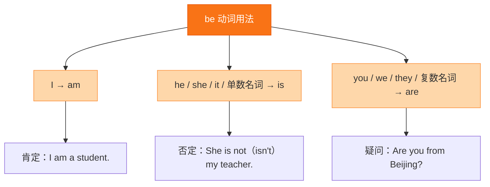

# Starter·综合练习

标签：#Starter #单元测试 #综合练习

## 一、练习说明

本练习覆盖 Starter 单元核心内容：问候语、自我介绍、be 动词、人称代词、数字与字母。建议限时 20 分钟完成，再对答案订正。

## 二、单项选择

1. — Good morning, Ms Li! — ______, Tony!
   A. Good night B. Good morning C. Goodbye
2. — ______ is your name? — My name is Daming.
   A. What B. How C. Where
3. I ______ twelve and my brother ______ fourteen.
   A. am; am B. is; am C. am; is
4. This is ______ English book.
   A. a B. an C. /
5. — Is she your teacher? — ______.
   A. Yes, she is B. Yes, she isn't C. No, she is
6. ______ is from America. ______ name is Betty.
   A. She; Her B. Her; She C. She; She
7. — How are you? — ______
   A. I'm twelve. B. I'm fine, thank you. C. I'm Tony.
8. thirteen 的正确含义是 ______。
   A. 三十 B. 十三 C. 三

## 三、用所给词的适当形式填空

1. I ______ (be) a student in Grade 7.
2. ______ (she) name is Lingling.
3. — Are you from Beijing? — Yes, ______ (I) am.
4. They ______ (be) my good friends.
5. This is ______ (a/an) apple.

## 四、按要求改写句子

1. He is from England.（改为一般疑问句）→ ______
2. They are in Class 3.（改为否定句）→ ______
3. My name is Wang Hui.（对画线部分提问，画线：Wang Hui）→ ______
4. is, teacher, my, she, English（连词成句）→ ______

## 五、汉译英

1. 欢迎来到我们学校！
2. 见到你很高兴。
3. 我十二岁，我在七年级一班。
4. 这是我的朋友，她来自上海。

## 结构图示

## 六、参考答案

**二、单项选择**
1. B（早晨问候回以同样的问候）
2. A（问名字用 What）
3. C（I 配 am，第三人称单数配 is）
4. B（English 元音音素开头用 an）
5. A（一般疑问句肯定答语 Yes, she is.）
6. A（作主语用 She，修饰 name 用 Her）
7. B（How are you? 问状况）
8. B

**三、词形填空**
1. am 2. Her 3. I 4. are 5. an

**四、改写句子**
1. Is he from England?
2. They are not (aren't) in Class 3.
3. What's your name?
4. She is my English teacher.

**五、汉译英**
1. Welcome to our school!
2. Nice to meet you.
3. I'm twelve (years old). I'm in Class 1, Grade 7.
4. This is my friend. She is from Shanghai.

## 七、易错提醒

- 第 3 题：并列主语各自配各自的 be 动词，不要"就近"乱选。
- 第 4 题：a/an 看后面单词的**发音**，English /ˈɪŋɡlɪʃ/ 元音开头。
- 汉译英"十二岁"用 be 动词，不用 have。

相关：[[Welcome to junior high!（欢迎来到初中）]] ｜ [[Starter·重点梳理]]
