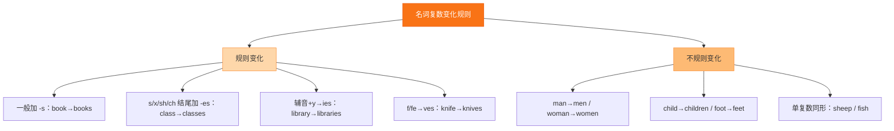

# Unit 1·综合练习

标签：#Unit1 #单元测试 #综合练习

## 一、练习说明

覆盖 Unit 1 核心：学校生活词汇、名词复数、一般现在时、特殊疑问句。建议限时 25 分钟。

## 二、单项选择

1. My new school is very big. There are three teaching ______ in it.
   A. building B. buildings C. buildinges
2. — ______ is your school? — It's next to the park.
   A. What B. Where C. How
3. I like history, ______ I don't like maths.
   A. and B. but C. or
4. — Do you have a PE lesson today? — ______
   A. Yes, I am. B. No, I don't. C. Yes, I don't.
5. There ______ lots of books in the library.
   A. is B. are C. am
6. My sister and I ______ in the same school, but we are in different ______.
   A. am; class B. are; classes C. are; class
7. — How many ______ do you have every day? — Six.
   A. lesson B. lessons C. a lesson
8. Miss Zhang helps me ______ my English.
   A. with B. of C. for

## 三、用所给词的适当形式填空

1. There are many ______ (child) on the playground.
2. Our school has two ______ (library).
3. I ______ (not like) science. It's difficult.
4. Look! These ______ (be) my new classmates.
5. My favourite ______ (subject) are English and art.

## 四、按要求改写句子

1. I like my new school.（改为否定句）→ ______
2. They have four lessons in the morning.（改为一般疑问句）→ ______
3. The dining hall is behind the teaching building.（对画线部分提问，画线：behind the teaching building）→ ______
4. school, different, my, is, from, yours（连词成句）→ ______

## 五、汉译英

1. 我的新学校又大又漂亮。
2. 我们班有四十五名学生。
3. 我最喜欢的学科是地理，因为它很有趣。
4. 开学第一天，我结交了许多新朋友。

## 结构图示

## 六、参考答案

**二、单项选择**
1. B（three 后接复数 buildings）
2. B（答语是地点，用 Where）
3. B（前后转折用 but）
4. B（Do 问 do 答；C 前后矛盾）
5. B（books 复数配 are）
6. B（主语复数配 are；different 后接复数）
7. B（how many + 复数）
8. A（help sb with sth 固定搭配）

**三、词形填空**
1. children 2. libraries 3. don't like 4. are 5. subjects

**四、改写句子**
1. I don't like my new school.
2. Do they have four lessons in the morning?
3. Where is the dining hall?
4. My school is different from yours.

**五、汉译英**
1. My new school is big and beautiful.
2. There are forty-five students in our class.
3. My favourite subject is geography, because it's interesting.
4. On the first day of school, I make lots of new friends.

## 七、易错提醒

- 第 4 题：用 do 提问必须用 do 回答，Yes 与 don't 不能同现。
- 第 6 题：same/different 常与单复数配合出题，in the same school（单数）、in different classes（复数）。
- 词形填空第 2 题：library 变复数要变 y 为 i 加 es。

相关：[[A new start（新的开始）]] ｜ [[Unit 1·重点梳理]]
