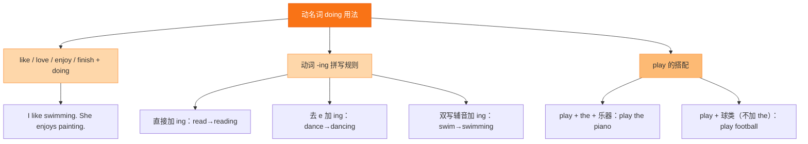

# Unit 2·重点梳理

标签：#Unit2 #语法梳理 #情态动词can #动名词

## 一、本单元语法总览

Unit 2 的语法核心：**情态动词 can 的用法**、**like/enjoy + doing（动名词）**、**祈使句与建议表达**。

## 二、情态动词 can

1. **表能力**："会、能"。I **can** swim. She **can** play the violin.
2. **三大特点**（所有情态动词通用）：
   - can 后接**动词原形**：He can **dance**（❌ He can dances / to dance）；
   - can **没有人称和数的变化**：I can / She can / They can；
   - 否定与疑问**不借助 do**：can't (cannot)；Can you...?
3. **句式转换**：
   - 肯定：Tom can play chess.
   - 否定：Tom **can't** play chess.
   - 一般疑问：**Can** Tom play chess? — Yes, he can. / No, he can't.
4. **常见错误对比**：
   - ❌ Do you can sing? → ✅ **Can** you sing?
   - ❌ She cans dance. → ✅ She **can** dance.

## 三、动名词作宾语与主语

1. **作宾语**：like / love / enjoy / be good at / be interested in + **doing**。
   - I enjoy **listening** to music. He is interested in **collecting** stamps.
2. **作主语**（谓语用单数）：
   - **Swimming is** good for our health. **Reading** opens up a new world.
3. -ing 拼写三规则：直接加（reading）、去 e 加（dancing）、双写加（swimming, running, shopping）。

## 四、建议与邀请的功能句

| 句型 | 例句 | 答语 |
|---|---|---|
| Let's + 动词原形 | Let's join the art club. | Good idea! / OK, let's go. |
| Why not + 动词原形? | Why not try something new? | That sounds great. |
| What about / How about + doing? | How about playing tennis? | Sounds fun! |
| Would you like to + 动词原形? | Would you like to come? | Yes, I'd love to. |

注意：**about 是介词，后接 doing**；Let's / Why not 后接**动词原形**。

## 五、需要记住的搭配

1. would like to do = want to do 想要做
2. try new things 尝试新事物
3. spend time on sth / (in) doing sth 在……上花时间
4. once a week 每周一次；twice a month 每月两次
5. not only... but also... 不但……而且……：Hobbies are **not only** fun **but also** useful.

## 结构图示

## 六、考点与易错点

- can 后动词原形，是初一上学期单选**必考**。
- How about 与 Why not 后接的动词形式不同（doing vs 原形），常放在一题中对比。
- 答语搭配：Can you...? 用 can/can't 回答；Would you like...? 用 I'd love/like to 回答。
- 动名词作主语谓语用单数：Collecting stamps **is** interesting.

## 七、小练习

1. My little sister can ______ very well.（A. dances B. dance C. dancing）
2. — Can you play the guitar? — ______（A. Yes, I do. B. No, I can't. C. Yes, I am.）
3. How about ______ to the music club with me?（A. go B. goes C. going）
4. ______ English every morning is a good habit.（A. Read B. Reading C. Reads）
5. Let's ______ football after school.（A. play B. playing C. to play）
6. 汉译英：他会下国际象棋，但他不会游泳。

**答案**：1. B 2. B 3. C 4. B 5. A 6. He can play chess, but he can't swim.

相关：[[More than fun（不只是乐趣——兴趣爱好）]] ｜ [[Unit 2·综合练习]]
