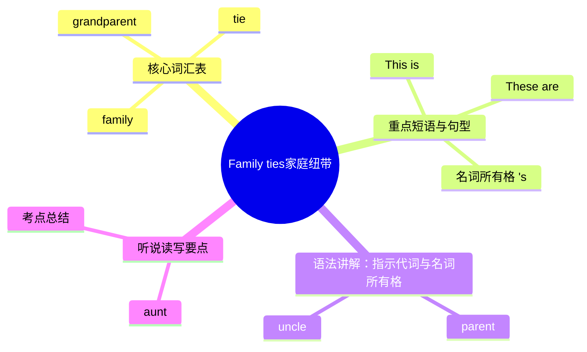

# Family ties（家庭纽带）

标签：#Unit3 #家庭 #介绍家人

## 一、单元定位

外研版七年级上册 **Unit 3 Family ties**，话题是"家庭纽带"。学习介绍家庭成员、描述家人的职业与外貌性格，体会家人之间的爱与联系（ties 纽带）。

## 二、核心词汇表

| 单词 | 词性 | 音标 | 中文 | 搭配 / 例句 |
|---|---|---|---|---|
| family | n. | /ˈfæməli/ | 家庭 | a big family |
| tie | n. | /taɪ/ | 纽带；领带 | family ties 家庭纽带 |
| grandparent | n. | /ˈɡrænpeərənt/ | 祖父/祖母 | my grandparents |
| grandpa / grandma | n. | — | 爷爷 / 奶奶 | Grandpa Wang |
| parent | n. | /ˈpeərənt/ | 父/母亲 | my parents 我的父母 |
| uncle | n. | /ˈʌŋkl/ | 叔；舅；姑父 | my uncle's son |
| aunt | n. | /ɑːnt/ | 姑；姨；婶 | Aunt Mary |
| cousin | n. | /ˈkʌzn/ | 堂/表兄弟姐妹 | my cousin Lily |
| doctor | n. | /ˈdɒktə/ | 医生 | She's a doctor. |
| nurse | n. | /nɜːs/ | 护士 | work as a nurse |
| driver | n. | /ˈdraɪvə/ | 司机 | a bus driver |
| worker | n. | /ˈwɜːkə/ | 工人 | a factory worker |
| hospital | n. | /ˈhɒspɪtl/ | 医院 | work in a hospital |
| kind | adj. | /kaɪnd/ | 和蔼的 | She is kind to me. |
| smart | adj. | /smɑːt/ | 聪明的 | a smart boy |

## 三、重点短语与句型

| 英文 | 中文 |
|---|---|
| a photo of my family | 一张我的全家福 |
| take care of / look after | 照顾 |
| spend time with... | 和……共度时光 |
| on the left / right | 在左边 / 右边 |
| next to... | 紧挨着…… |
| Who's this? — This is my grandma. | 这是谁？——这是我奶奶。 |
| What does your father do? — He's a doctor. | 你爸爸做什么工作？——他是医生。 |
| How many people are there in your family? | 你家有几口人？ |
| These are my parents, and those are my grandparents. | 这些是我父母，那些是我的祖父母。 |

## 四、语法讲解：指示代词与名词所有格

1. **指示代词 this / that / these / those**：
   - 近处单数 this，远处单数 that；近处复数 these，远处复数 those。
   - **This is** my brother. → 复数：**These are** my brothers.
   - 电话用语：This is Tony (speaking). 打电话自称用 this，不用 I am。
2. **名词所有格 's**：
   - 单数名词 + 's：Tom**'s** mother 汤姆的妈妈；
   - 以 s 结尾的复数名词只加 '：the students**'** books；
   - 不规则复数照加 's：children**'s** Day；
   - 两人共有：Lucy **and** Lily**'s** room（一间共有的房间）。
3. **常见错误对比**：
   - ❌ This is Tom mother. → ✅ This is Tom**'s** mother.
   - ❌ These is my cousins. → ✅ These **are** my cousins.

## 五、听说读写要点

- **功能表达**：借助全家福介绍家人（称谓、职业、外貌、性格）；询问职业 What does he/she do? = What's his/her job?
- **写作模板**：This is a photo of my family. There are ... people in my family: ... My father is a ... He is ... My mother ... I love my family because ...
- 听力常考：数字（几口人）、职业词、位置（on the left / next to）。

## 结构图示

## 六、考点与易错点

- **family** 指"家庭整体"时谓语用单数（My family **is** big），指"家庭成员"时用复数（My family **are** all at home）。初一阶段以第一种为主。
- parents（父母，两人）与 parent（父母中一人）区分。
- What does your mother do? 中 do 是实义动词"做（工作）"，回答职业而不是动作。
- cousin 不分男女、不分堂表，中文翻译需看语境。

## 七、小练习

1. ______ are my grandparents in the photo.（A. This B. That C. Those）
2. — ______ your uncle ______? — He is a bus driver.（A. What does; do B. What is; do C. What does; does）
3. This is my ______ bedroom. They like it very much.（A. parents B. parents' C. parent）
4. My aunt is a nurse. She works in a ______.（A. school B. hospital C. factory）
5. 汉译英：这是一张我的全家福，我家有五口人。
6. 汉译英：我爷爷很和蔼，他总是照顾我。

**答案**：1. C 2. A 3. B 4. B 5. This is a photo of my family. There are five people in my family. 6. My grandpa is very kind. He always takes care of me.

相关：[[Unit 3·重点梳理]] ｜ [[Unit 3·综合练习]] ｜ [[Starter·重点梳理]]
