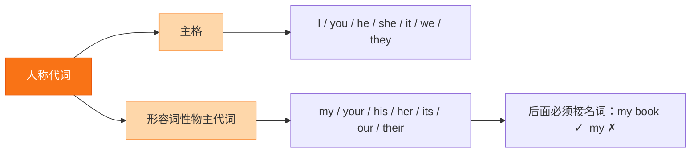

# Unit 3·重点梳理

标签：#Unit3 #语法梳理 #一般现在时三单 #物主代词

## 一、本单元语法总览

Unit 3 的语法核心：**一般现在时第三人称单数（三单）**、**物主代词完整体系**、**名词所有格**。这是初一上学期最重要的语法关卡之一。

## 二、一般现在时·第三人称单数

1. **什么时候用三单**：主语是 he / she / it 或单数名词（my father, Lucy）时，谓语动词加 -s/-es。
2. **动词三单变化规则**：
   - 一般加 -s：work → works, like → likes；
   - 以 s/x/sh/ch/o 结尾加 -es：watch → watches, go → goes, do → does；
   - 辅音字母 + y 结尾变 y 为 i 加 -es：study → studies, fly → flies；
   - 特殊：have → **has**。
3. **否定与疑问借助 does**（does 出现后动词还原）：
   - 肯定：My father **works** in a hospital.
   - 否定：My father **doesn't work** in a hospital.
   - 疑问：**Does** your father **work** in a hospital? — Yes, he does. / No, he doesn't.
4. **常见错误对比**：
   - ❌ She don't like milk. → ✅ She **doesn't** like milk.
   - ❌ Does he goes to school by bus? → ✅ Does he **go** ...?（does 后还原）
   - ❌ My mother have a new bike. → ✅ My mother **has** a new bike.

## 三、物主代词完整表

| 人称 | 主格 | 形容词性物主代词 | 用法 |
|---|---|---|---|
| 我 | I | my | my family |
| 你/你们 | you | your | your cousin |
| 他 | he | his | his job |
| 她 | she | her | her parents |
| 它 | it | its | its name |
| 我们 | we | our | our school |
| 他们 | they | their | their photos |

- 形容词性物主代词**后必须接名词**。
- its（它的）与 it's（it is 缩写）拼写区分是高频考点。

## 四、名词所有格要点回顾

- 单数 + 's：my sister**'s** room；复数以 s 结尾只加 '：my grandparents**'** house。
- **of 结构**表"……的"多用于无生命物：a photo **of** my family（❌ my family's photo 虽可说，但教材以 of 结构为准）。

## 五、需要记住的搭配

1. help sb do sth / help sb with sth 帮助某人做某事
2. be strict with sb 对某人严格
3. at home 在家；at work 在工作
4. every day 每天（everyday 是形容词"日常的"）
5. one of + 复数名词：one of my cousins 我表兄弟中的一个

## 结构图示

## 六、考点与易错点

- 三单是**整个初一考试出现频率最高**的语法点：单选、词形填空、改错都会考。
- 记住"**一句话只有一个 (e)s**"：Does 出现，动词还原；doesn't 出现，动词还原。
- 频度副词（always, usually, often, sometimes, never）位于**实义动词前、be 动词后**：He **often helps** me. / She **is always** kind.
- its / it's、his（他的）/ he's（he is）易混淆。

## 七、小练习

1. My mother ______ (watch) TV after dinner every day.
2. — Does your cousin like sports? — Yes, he ______.（A. like B. does C. do）
3. Lucy ______ her homework in the evening.（A. do B. does C. doing）
4. My uncle doesn't ______ in a factory.（A. works B. work C. working）
5. ______ name is Betty and ______ is from England.（A. Her; she B. She; her C. Hers; she）
6. 汉译英：我爸爸在医院工作，他每天很早去上班。

**答案**：1. watches 2. B 3. B 4. B 5. A 6. My father works in a hospital. He goes to work early every day.

相关：[[Family ties（家庭纽带）]] ｜ [[Unit 3·综合练习]]
