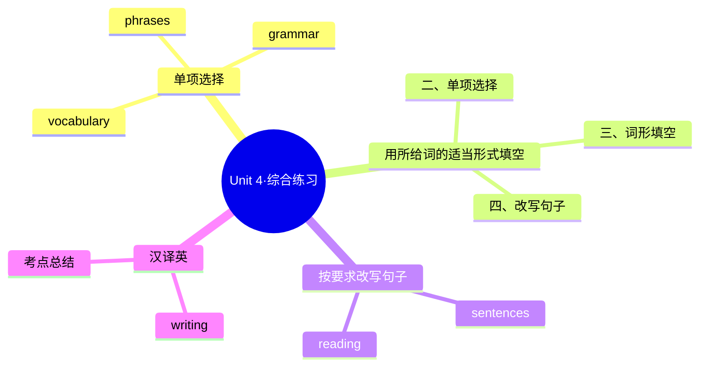

# Unit 4·综合练习

标签：#Unit4 #单元测试 #综合练习

## 一、练习说明

覆盖 Unit 4 核心：节日词汇、月份序数词、时间介词 in/on/at、when 疑问句。建议限时 25 分钟。

## 二、单项选择

1. — When is Teachers' Day? — It's ______ September 10th.
   A. in B. on C. at
2. People usually eat ______ at the Dragon Boat Festival.
   A. mooncakes B. zongzi C. turkey
3. October is the ______ month of the year.
   A. ten B. tenth C. tenneth
4. — ______ do people celebrate Thanksgiving? — They have a big dinner and eat turkey.
   A. When B. How C. Where
5. My grandparents come to our home ______ the Spring Festival every year.
   A. at B. on C. in
6. It's time ______ up lanterns for the festival.
   A. put B. to put C. putting
7. Everyone ______ excited at the New Year party.
   A. is B. are C. be
8. We give cards and gifts ______ our teachers on Teachers' Day.
   A. for B. of C. to

## 三、用所给词的适当形式填空

1. The Spring Festival is my ______ (favourite) festival.
2. My birthday is on the ______ (five) of June.
3. People ______ (make) dumplings before the Spring Festival.
4. My mother ______ (get) ready for the family dinner before the festival every year.
5. There are many ______ (celebration) during the festival.

## 四、按要求改写句子

1. The Mid-Autumn Festival is in September or October.（对画线部分提问，画线：in September or October）→ ______
2. People watch dragon boat races at the festival.（改为一般疑问句）→ ______
3. It's time for dinner.（改为同义句，用 to）→ ______
4. festival, is, to, time, celebrate, the, it（连词成句）→ ______

## 五、汉译英

1. 春节在一月或二月。
2. 人们团聚在一起，吃一顿丰盛的晚餐。
3. 孩子们在那天收到礼物，他们非常开心。
4. 该为节日做准备了。

## 结构图示

## 六、参考答案

**二、单项选择**
1. B（具体日期用 on）
2. B（端午节吃粽子）
3. B（序数词 tenth）
4. B（答语是方式，用 How）
5. A（节日期间用 at）
6. B（It's time to do）
7. A（everyone 单数）
8. C（give sth to sb）

**三、词形填空**
1. favourite 2. fifth（注意拼写）3. make 4. gets 5. celebrations

**四、改写句子**
1. When is the Mid-Autumn Festival?
2. Do people watch dragon boat races at the festival?
3. It's time to have dinner.
4. It is time to celebrate the festival.

**五、汉译英**
1. The Spring Festival is in January or February.
2. People get together and have a big dinner.
3. Children get gifts/presents on that day. They are very happy.
4. It's time to get ready for the festival.

## 七、易错提醒

- 第 1 题与第 5 题对比：具体日期 on，节日期间 at，月份 in。
- 词形填空第 2 题：five 的序数词是 **fifth**，不是 fiveth。
- 汉译英第 2 题：get together 是固定短语，不要写成 get to together。

相关：[[Time to celebrate（欢庆时刻——节日）]] ｜ [[Unit 4·重点梳理]]
