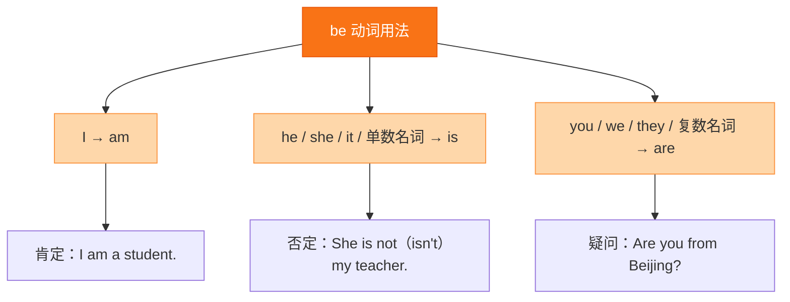

# Unit 5·重点梳理

标签：#Unit5 #语法梳理 #therebe #不可数名词

## 一、本单元语法总览

Unit 5 的语法核心：**there be 句型**、**可数与不可数名词（巩固）**、**some/any 的用法**。

## 二、there be 句型

1. **基本含义**："某地有某物"，表示"存在"。
   - There **is** a big tree in front of my house.
   - There **are** many flowers in the garden.
2. **就近原则**：be 动词与**最近的名词**保持一致。
   - There **is** a pen and two books on the desk.（先 a pen → is）
   - There **are** two books and a pen on the desk.（先 two books → are）
3. **否定与疑问**：
   - 否定：There **isn't/aren't** ...：There isn't any water in the bottle.
   - 一般疑问：**Is/Are there** ...? — Yes, there is/are. / No, there isn't/aren't.
   - How many + 复数 + are there...?：How many parks are there in your city?
4. **there be 与 have 的区别**：
   - there be 表"存在"：There is a library in our school.（学校里有图书馆）
   - have 表"拥有"：Our school **has** a library.（两句可互换表达，但不能混用结构）
   - ❌ There have many trees. → ✅ There **are** many trees.

## 三、some 与 any

| 词 | 用于 | 例句 |
|---|---|---|
| some | 肯定句；表建议/请求的疑问句 | There are some birds in the tree. / Would you like some tea? |
| any | 否定句、一般疑问句 | There aren't any apples. / Is there any milk? |

- 两者后面都可接**可数复数**或**不可数名词**。

## 四、不可数名词要点（巩固）

- 常见不可数：water, rice, bread, milk, tea, food, fruit(泛指), money, work。
- 作主语谓语用**单数**：The water **is** clean.
- 计量：a cup of tea → two cup**s** of tea（单位词变复数）。

## 五、需要记住的搭配

1. be full of 充满：The garden is full of flowers.
2. all year round 一年到头
3. in the north/south of... 在……的北方/南方
4. take in 吸收：Plants take in water through their roots.
5. more and more 越来越多：More and more people plant trees.

## 结构图示

## 六、考点与易错点

- there be **就近原则**是期末必考单选题。
- there be 句型中不能出现 have（There have 是典型错误）。
- Is there any...? 肯定回答 Yes, there **is**（不是 Yes, it is）。
- How many + **复数名词** + are there：How many **birds** are there in the tree?

## 七、小练习

1. There ______ a lot of water in the river.（A. is B. are C. have）
2. There ______ two apples and an orange in the bag.（A. is B. are C. am）
3. — Is there ______ milk in the fridge? — No, there isn't ______.（A. some; any B. any; any C. any; some）
4. There ______ an eraser and two pencils in the pencil box.（A. is B. are C. has）
5. — How many trees ______ in the park? — About two hundred.（A. is there B. are there C. there are）
6. 汉译英：我们学校里有一个大花园，里面满是花草。

**答案**：1. A（water 不可数）2. B（就近 two apples）3. B 4. A（就近 an eraser）5. B 6. There is a big garden in our school. It's full of flowers and grass.

相关：[[The power of plants（植物的力量）]] ｜ [[Unit 5·综合练习]]
