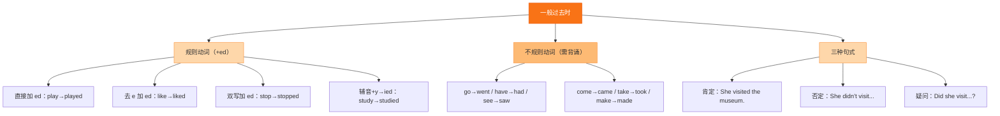

# Go for it!（勇敢尝试）

标签：#Unit2 #勇敢尝试 #一般过去时不规则动词

## 一、单元定位

外研版七年级下册 **Unit 2**，话题是"勇敢尝试"。课文讲述人们克服恐惧、挑战自我的经历（如第一次登台、学游泳、参加比赛），鼓励我们敢于走出舒适区。语法主线是**一般过去时的不规则动词**，用来讲述过去的尝试经历。

## 二、核心词汇表

| 单词 | 词性 | 中文 | 搭配 / 例句 |
|---|---|---|---|
| try | v./n. | 尝试 | try to do sth 努力做某事 |
| brave | adj. | 勇敢的 | be brave enough to... |
| afraid | adj. | 害怕的 | be afraid of... 害怕…… |
| fail | v. | 失败 | Don't be afraid of failing. |
| succeed | v. | 成功 | succeed in doing sth |
| challenge | n./v. | 挑战 | face a challenge 面对挑战 |
| nervous | adj. | 紧张的 | feel nervous 感到紧张 |
| confident | adj. | 自信的 | be confident in oneself |
| give up | 短语 | 放弃 | Never give up! |
| mistake | n. | 错误 | make a mistake 犯错 |
| chance | n. | 机会 | Take the chance! 抓住机会！ |
| finally | adv. | 最终 | Finally, I made it. |

## 三、重点短语与句型

| 英文 | 中文 |
|---|---|
| go for it | 加油；放手去做 |
| for the first time | 第一次 |
| at first / in the end | 起初 / 最后 |
| be afraid of making mistakes | 害怕犯错 |
| learn from... | 向……学习；从……中吸取教训 |
| I was nervous at first, but I made it. | 起初我很紧张，但我做到了。 |
| It took me two weeks to learn swimming. | 学游泳花了我两周时间。 |
| Believe in yourself and have a try. | 相信自己，试一试。 |

## 四、语法要点：一般过去时（不规则动词）

1. 不规则动词的过去式**没有统一规则，必须逐个记忆**。本单元高频词：
   go → went, come → came, see → saw, take → took, make → made, get → got, have → had, do → did, say → said, find → found, feel → felt, think → thought, run → ran, swim → swam, win → won, fall → fell, begin → began。
2. 否定和疑问仍借助 **did**，动词还原：I didn't win, but I learned a lot. / Did you fall into the water?
3. 叙事常用连接词：at first → then → finally / in the end，使经历有条理。

## 五、考点与易错点

- 不规则动词没有 -ed 形式：goed ❌ went ✔；maked ❌ made ✔。
- did 之后还原：Did you took ❌ → Did you take ✔。
- be afraid of 后接名词或 **doing**：be afraid of speak ❌ → be afraid of speaking ✔。
- It takes/took sb some time to do sth：注意时态与 to do。

## 结构图示

## 六、小练习

1. Last summer I ______ (swim) in the sea for the first time.
2. She was nervous, but she ______ (not give) up.
3. — ______ you ______ (win) the game? — No, but I did my best.
4. He was afraid of ______ (make) mistakes in class.
5. 汉译英：起初我很害怕，但最后我成功了。

**答案**：1. swam 2. didn't give 3. Did; win 4. making 5. At first I was afraid, but in the end I succeeded.

相关：[[Unit 2·重点梳理]] ｜ [[Unit 2·综合练习]] ｜ [[The secrets of happiness（幸福的秘诀）]]
