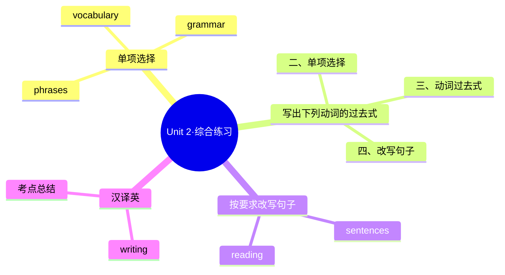

# Unit 2·综合练习

标签：#Unit2 #单元测试 #综合练习

## 一、练习说明

覆盖 Unit 2 核心：勇敢尝试话题词汇、不规则动词过去式、过去时叙事表达。建议限时 25 分钟。

## 二、单项选择

1. Lucy ______ swimming for the first time last summer.
   A. goes B. went C. goed
2. — Did you win the singing competition? — No, but I ______ a lot from it.
   A. learn B. learned C. learns
3. Don't be afraid of ______ mistakes when you speak English.
   A. make B. to make C. making
4. It ______ me two hours to climb the hill yesterday.
   A. took B. takes C. spent
5. At first he was nervous, but ______ he finished the speech well.
   A. at first B. in the end C. so far
6. My teacher encouraged me ______ part in the race.
   A. take B. taking C. to take
7. She ______ up early and ______ to school by bike this morning.
   A. got; rode B. got; rided C. getted; rode
8. — How did you feel after the game? — ______
   A. I feel great. B. I felt great. C. I am great.

## 三、写出下列动词的过去式

1. think → ______ 2. swim → ______ 3. buy → ______ 4. fall → ______ 5. teach → ______ 6. begin → ______ 7. know → ______ 8. read → ______

## 四、按要求改写句子

1. He took many photos at the sports meeting.（改为否定句）→ ______
2. They came to Beijing two years ago.（改为一般疑问句）→ ______
3. She felt very nervous before the exam.（对画线部分提问，画线：very nervous）→ ______
4. up, never, dream, give, your（连词成句）→ ______

## 五、汉译英

1. 我第一次登台时非常紧张。
2. 他没有放弃，最终成功了。
3. 学骑自行车花了我一周时间。
4. 相信你自己，勇敢尝试吧！

## 结构图示

## 六、参考答案

**二、单项选择**
1. B（go 的过去式 went）2. B 3. C（be afraid of + doing）4. A（It took sb time to do）5. B（前后对比，"最后"）6. C（encourage sb to do）7. A（get→got，ride→rode）8. B（问的是过去，用 felt）

**三、动词过去式**
1. thought 2. swam 3. bought 4. fell 5. taught 6. began 7. knew 8. read（读音 /red/）

**四、改写句子**
1. He didn't take many photos at the sports meeting.
2. Did they come to Beijing two years ago?
3. How did she feel before the exam?
4. Never give up your dream.

**五、汉译英**
1. I was very nervous when I went on the stage for the first time.
2. He didn't give up and finally succeeded.
3. It took me a week to learn to ride a bike.
4. Believe in yourself and go for it!

## 七、易错提醒

- 第 4 题：It ... to do 结构配 took；spent 的主语必须是人。
- 第 7 题：两个动词都要变过去式，且都是不规则变化。
- 动词过去式第 8 题：read 过去式拼写不变，考试常考读音辨析。

相关：[[Go for it!（勇敢尝试）]] ｜ [[Unit 2·重点梳理]]
